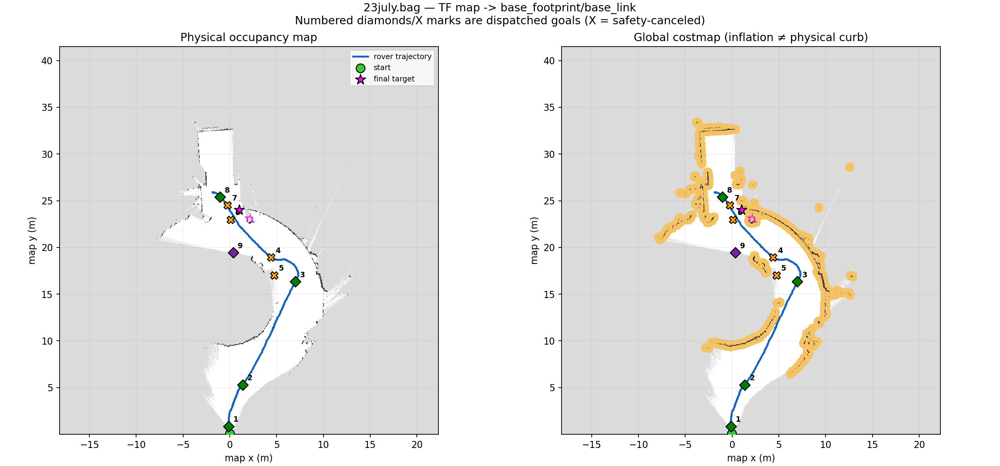
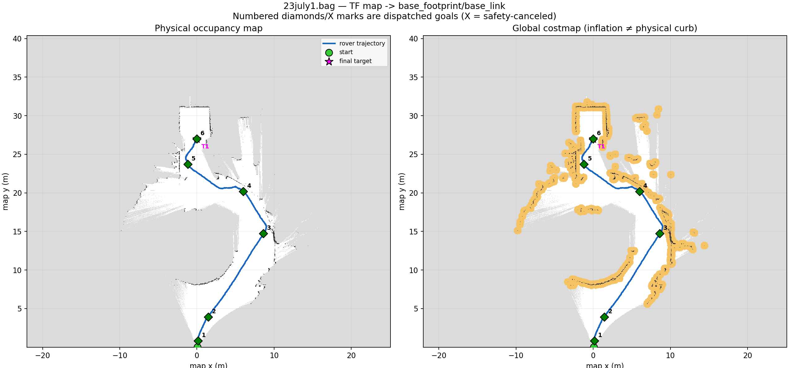
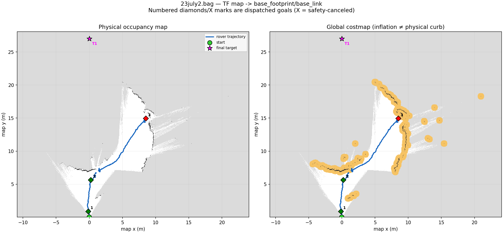
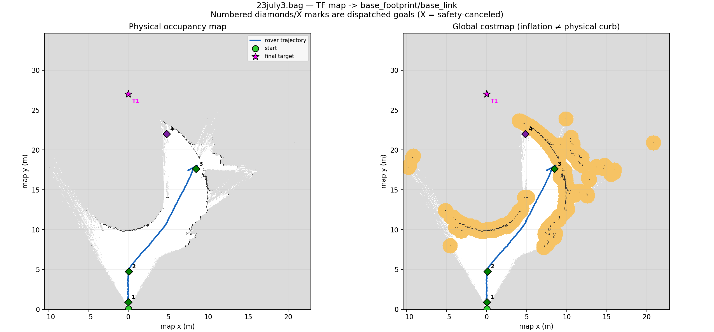
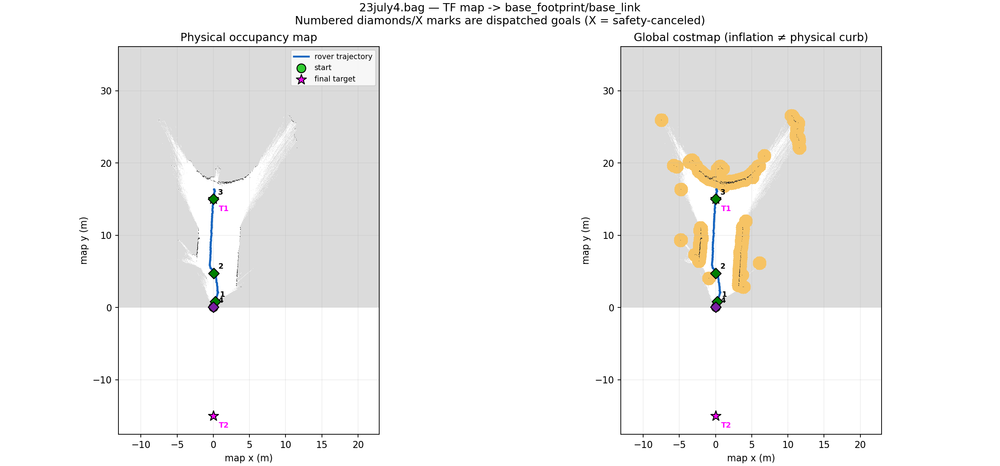

# July 23 rover bag analysis

Generated by `analyze_bags.py` using offline `rosbag2_py` decoding. No bag was replayed and nothing was published to a ROS graph.

## Executive summary

The clearance-regression hypothesis is **SUPPORTED**. The first run recorded a 1.70 m endpoint requirement and 1327 frontier-clearance rejections (18.55/s), versus 369 across the four 0.10 m runs (0.92/s). The first run made 4 active-goal obstacle-clearance cancellation(s); the later runs made 0.

The first run also selected two Target Explorer recovery frontiers, including a negative-progress goal, while the later runs selected none. By contrast, 23july2's long third goal triggered genuine Nav2 recovery behaviors and ultimately status 6 (`ABORTED`); that is a separate planner/controller failure mode, not an endpoint-clearance cancellation.

The final conclusion is based on direct Target Explorer logs, recorded maps/costmaps, and map-frame TF trajectory. Action request/status topics were not recorded, so action acceptance and terminal results are reconstructed from Target Explorer, bt_navigator, planner, and controller logs. Static parameters absent from `/parameter_events` cannot be recovered from a bag alone.

## Bag inventory

| bag | start (local time) | duration (s) | messages | storage | key evidence |
| --- | --- | --- | --- | --- | --- |
| 23july.bag | 2026-07-23T21:03:07.639+05:30 | 71.542 | 1,135,406 | sqlite3 | rosout=/rosout (5961); parameters=/parameter_events (28); map=/map (478); global costmap=/global_costmap/costmap (83); TF=/tf (2745), /tf_static (4); odom=/genz/odometry (796), /odometry/filtered (2146); plans=/plan (108), /received_global_plan (1257); cmd_vel=/cmd_vel (1323) |
| 23july1.bag | 2026-07-23T21:17:04.323+05:30 | 68.574 | 1,082,185 | sqlite3 | rosout=/rosout (5090); parameters=/parameter_events (28); map=/map (458); global costmap=/global_costmap/costmap (80); TF=/tf (2631), /tf_static (4); odom=/genz/odometry (761), /odometry/filtered (2056); plans=/plan (107), /received_global_plan (1107); cmd_vel=/cmd_vel (1238) |
| 23july2.bag | 2026-07-23T21:20:26.730+05:30 | 140.254 | 2,223,855 | sqlite3 | rosout=/rosout (9561); parameters=/parameter_events (30); map=/map (903); global costmap=/global_costmap/costmap (157); TF=/tf (5188), /tf_static (4); odom=/genz/odometry (1481), /odometry/filtered (4058); plans=/plan (116), /received_global_plan (2061); cmd_vel=/cmd_vel (2895) |
| 23july3.bag | 2026-07-23T21:24:47.027+05:30 | 78.467 | 1,227,569 | sqlite3 | rosout=/rosout (5572); parameters=/parameter_events (28); map=/map (524); global costmap=/global_costmap/costmap (91); TF=/tf (3009), /tf_static (4); odom=/genz/odometry (873), /odometry/filtered (2355); plans=/plan (90), /received_global_plan (1468); cmd_vel=/cmd_vel (1488) |
| 23july4.bag | 2026-07-23T21:47:13.074+05:30 | 113.521 | 1,782,949 | sqlite3 | rosout=/rosout (8325); parameters=/parameter_events (54); map=/map (757); global costmap=/global_costmap/costmap (132); TF=/tf (4348), /tf_static (4); odom=/genz/odometry (1262), /odometry/filtered (3404); plans=/plan (83), /received_global_plan (1398); cmd_vel=/cmd_vel (2334) |

All five metadata files identify `sqlite3`. Topic inventories and message types come from each `metadata.yaml`; the full inventory is reproducible in [bag_inventory.csv](bag_inventory.csv), including per-topic counts and average frequencies. No normal NavigateToPose action goal/status/feedback topic had messages in these recordings.

## Parameter recovery and confidence

| parameter | 23july.bag | 23july1.bag | 23july2.bag | 23july3.bag | 23july4.bag | evidence/confidence |
| --- | --- | --- | --- | --- | --- | --- |
| target_explorer.goal_obstacle_clearance_m | 1.70 [CONFIRMED_IN_BAG] | 0.10 [CONFIRMED_IN_BAG] | 0.10 [CONFIRMED_IN_BAG] | 0.10 [CONFIRMED_IN_BAG] | 0.10 [CONFIRMED_IN_BAG] | Required clearance is written verbatim in Target Explorer /rosout. |
| target_explorer.final_target_(x,y) | (1.00, 24.00) [CONFIRMED_IN_BAG] | (0.00, 27.00) [CONFIRMED_IN_BAG] | (0.00, 27.00) [CONFIRMED_IN_BAG] | (0.00, 27.00) [CONFIRMED_IN_BAG] | (0.00, -15.00) [CONFIRMED_IN_BAG] | Startup /rosout records the final local target. |
| local_costmap.effective_published_footprint_radius_m | 1.015 [CONFIRMED_IN_BAG] | 1.015 [CONFIRMED_IN_BAG] | 1.015 [CONFIRMED_IN_BAG] | 1.015 [CONFIRMED_IN_BAG] | 1.015 [CONFIRMED_IN_BAG] | Derived from recorded published-footprint vertices. This confirms effective geometry, not whether robot_radius or footprint produced it. |
| local_costmap.robot_radius | 1.0 [STRONGLY_INFERRED] | 1.0 [STRONGLY_INFERRED] | 1.0 [STRONGLY_INFERRED] | 1.0 [STRONGLY_INFERRED] | 1.0 [STRONGLY_INFERRED] | robot_radius is 1.0 in both the git baseline and matching installed Nav2 YAML; the separately reported recorded footprint geometry is consistent with this value. No static event emitted the config key. |
| global_costmap.effective_published_footprint_radius_m | 1.015 [CONFIRMED_IN_BAG] | 1.015 [CONFIRMED_IN_BAG] | 1.015 [CONFIRMED_IN_BAG] | 1.015 [CONFIRMED_IN_BAG] | 1.015 [CONFIRMED_IN_BAG] | Derived from recorded published-footprint vertices. This confirms effective geometry, not whether robot_radius or footprint produced it. |
| global_costmap.robot_radius | 1.0 [STRONGLY_INFERRED] | 1.0 [STRONGLY_INFERRED] | 1.0 [STRONGLY_INFERRED] | 1.0 [STRONGLY_INFERRED] | 1.0 [STRONGLY_INFERRED] | robot_radius is 1.0 in both the git baseline and matching installed Nav2 YAML; the separately reported recorded footprint geometry is consistent with this value. No static event emitted the config key. |
| map.resolution | 0.050 [CONFIRMED_IN_BAG] | 0.050 [CONFIRMED_IN_BAG] | 0.050 [CONFIRMED_IN_BAG] | 0.050 [CONFIRMED_IN_BAG] | 0.050 [CONFIRMED_IN_BAG] | Recorded OccupancyGrid metadata. |
| global_costmap.resolution | 0.050 [CONFIRMED_IN_BAG] | 0.050 [CONFIRMED_IN_BAG] | 0.050 [CONFIRMED_IN_BAG] | 0.050 [CONFIRMED_IN_BAG] | 0.050 [CONFIRMED_IN_BAG] | Recorded OccupancyGrid metadata. |
| local_costmap.resolution | 0.020 [CONFIRMED_IN_BAG] | 0.020 [CONFIRMED_IN_BAG] | 0.020 [CONFIRMED_IN_BAG] | 0.020 [CONFIRMED_IN_BAG] | 0.020 [CONFIRMED_IN_BAG] | Recorded OccupancyGrid metadata. |
| local_costmap.inflation_radius | 0.50 [STRONGLY_INFERRED] | 0.50 [STRONGLY_INFERRED] | 0.50 [STRONGLY_INFERRED] | 0.95 [STRONGLY_INFERRED] | 0.95 [STRONGLY_INFERRED] | Git baseline was 0.50; installed YAML became 0.95 at 21:22:36. Nav2 for 23july/1/2 started before that copy; Nav2 for 23july3/4 started after it. Static values were not emitted in bag events. |
| global_costmap.inflation_radius | 0.50 [STRONGLY_INFERRED] | 0.50 [STRONGLY_INFERRED] | 0.50 [STRONGLY_INFERRED] | 0.95 [STRONGLY_INFERRED] | 0.95 [STRONGLY_INFERRED] | Git baseline was 0.50; installed YAML became 0.95 at 21:22:36. Nav2 for 23july/1/2 started before that copy; Nav2 for 23july3/4 started after it. Static values were not emitted in bag events. |
| local_costmap.inflation_layer.cost_scaling_factor | 5.0 [STRONGLY_INFERRED] | 5.0 [STRONGLY_INFERRED] | 5.0 [STRONGLY_INFERRED] | 5.0 [STRONGLY_INFERRED] | 5.0 [STRONGLY_INFERRED] | Value is unchanged across git baseline, source, and installed matching YAML. |
| global_costmap.inflation_layer.cost_scaling_factor | 3.0 [STRONGLY_INFERRED] | 3.0 [STRONGLY_INFERRED] | 3.0 [STRONGLY_INFERRED] | 3.0 [STRONGLY_INFERRED] | 3.0 [STRONGLY_INFERRED] | Value is unchanged across git baseline, source, and installed matching YAML. |
| local_costmap.obstacle_layer.scan.obstacle_min_range | 0.1 [STRONGLY_INFERRED] | 0.1 [STRONGLY_INFERRED] | 0.1 [STRONGLY_INFERRED] | 0.1 [STRONGLY_INFERRED] | 0.1 [STRONGLY_INFERRED] | Unchanged across the pre-test git baseline and matching installed Nav2 YAML; not emitted as a static ParameterEvent. |
| local_costmap.obstacle_layer.scan.obstacle_max_range | 6.0 [STRONGLY_INFERRED] | 6.0 [STRONGLY_INFERRED] | 6.0 [STRONGLY_INFERRED] | 6.0 [STRONGLY_INFERRED] | 6.0 [STRONGLY_INFERRED] | Unchanged across the pre-test git baseline and matching installed Nav2 YAML; not emitted as a static ParameterEvent. |
| local_costmap.obstacle_layer.scan.raytrace_max_range | 6.0 [STRONGLY_INFERRED] | 6.0 [STRONGLY_INFERRED] | 6.0 [STRONGLY_INFERRED] | 6.0 [STRONGLY_INFERRED] | 6.0 [STRONGLY_INFERRED] | Unchanged across the pre-test git baseline and matching installed Nav2 YAML; not emitted as a static ParameterEvent. |
| local_costmap.obstacle_layer.scan.min_obstacle_height | 0.2 [STRONGLY_INFERRED] | 0.2 [STRONGLY_INFERRED] | 0.2 [STRONGLY_INFERRED] | 0.2 [STRONGLY_INFERRED] | 0.2 [STRONGLY_INFERRED] | Unchanged across the pre-test git baseline and matching installed Nav2 YAML; not emitted as a static ParameterEvent. |
| local_costmap.obstacle_layer.scan.max_obstacle_height | 2.0 [STRONGLY_INFERRED] | 2.0 [STRONGLY_INFERRED] | 2.0 [STRONGLY_INFERRED] | 2.0 [STRONGLY_INFERRED] | 2.0 [STRONGLY_INFERRED] | Unchanged across the pre-test git baseline and matching installed Nav2 YAML; not emitted as a static ParameterEvent. |
| global_costmap.obstacle_layer.scan.obstacle_min_range | 0.1 [STRONGLY_INFERRED] | 0.1 [STRONGLY_INFERRED] | 0.1 [STRONGLY_INFERRED] | 0.1 [STRONGLY_INFERRED] | 0.1 [STRONGLY_INFERRED] | Unchanged across the pre-test git baseline and matching installed Nav2 YAML; not emitted as a static ParameterEvent. |
| global_costmap.obstacle_layer.scan.obstacle_max_range | 20.0 [STRONGLY_INFERRED] | 20.0 [STRONGLY_INFERRED] | 20.0 [STRONGLY_INFERRED] | 20.0 [STRONGLY_INFERRED] | 20.0 [STRONGLY_INFERRED] | Unchanged across the pre-test git baseline and matching installed Nav2 YAML; not emitted as a static ParameterEvent. |
| global_costmap.obstacle_layer.scan.raytrace_min_range | 0.0 [STRONGLY_INFERRED] | 0.0 [STRONGLY_INFERRED] | 0.0 [STRONGLY_INFERRED] | 0.0 [STRONGLY_INFERRED] | 0.0 [STRONGLY_INFERRED] | Unchanged across the pre-test git baseline and matching installed Nav2 YAML; not emitted as a static ParameterEvent. |
| global_costmap.obstacle_layer.scan.raytrace_max_range | 20.0 [STRONGLY_INFERRED] | 20.0 [STRONGLY_INFERRED] | 20.0 [STRONGLY_INFERRED] | 20.0 [STRONGLY_INFERRED] | 20.0 [STRONGLY_INFERRED] | Unchanged across the pre-test git baseline and matching installed Nav2 YAML; not emitted as a static ParameterEvent. |
| global_costmap.obstacle_layer.scan.min_obstacle_height | 0.20 [STRONGLY_INFERRED] | 0.20 [STRONGLY_INFERRED] | 0.20 [STRONGLY_INFERRED] | 0.20 [STRONGLY_INFERRED] | 0.20 [STRONGLY_INFERRED] | Unchanged across the pre-test git baseline and matching installed Nav2 YAML; not emitted as a static ParameterEvent. |
| global_costmap.obstacle_layer.scan.max_obstacle_height | 1.85 [STRONGLY_INFERRED] | 1.85 [STRONGLY_INFERRED] | 1.85 [STRONGLY_INFERRED] | 1.85 [STRONGLY_INFERRED] | 1.85 [STRONGLY_INFERRED] | Unchanged across the pre-test git baseline and matching installed Nav2 YAML; not emitted as a static ParameterEvent. |
| planner_server.GridBased.tolerance | 0.5 [STRONGLY_INFERRED] | 0.5 [STRONGLY_INFERRED] | 0.5 [STRONGLY_INFERRED] | 0.5 [STRONGLY_INFERRED] | 0.5 [STRONGLY_INFERRED] | Unchanged across the pre-test git baseline and matching installed Nav2 YAML; not emitted as a static ParameterEvent. |
| planner_server.GridBased.allow_unknown | false [STRONGLY_INFERRED] | false [STRONGLY_INFERRED] | false [STRONGLY_INFERRED] | false [STRONGLY_INFERRED] | false [STRONGLY_INFERRED] | Unchanged across the pre-test git baseline and matching installed Nav2 YAML; not emitted as a static ParameterEvent. |
| controller_server.FollowPath.lookahead_dist | 1.0 [STRONGLY_INFERRED] | 1.0 [STRONGLY_INFERRED] | 1.0 [STRONGLY_INFERRED] | 1.0 [STRONGLY_INFERRED] | 1.0 [STRONGLY_INFERRED] | Unchanged across the pre-test git baseline and matching installed Nav2 YAML; not emitted as a static ParameterEvent. |
| controller_server.FollowPath.min_lookahead_dist | 0.8 [STRONGLY_INFERRED] | 0.8 [STRONGLY_INFERRED] | 0.8 [STRONGLY_INFERRED] | 0.8 [STRONGLY_INFERRED] | 0.8 [STRONGLY_INFERRED] | Unchanged across the pre-test git baseline and matching installed Nav2 YAML; not emitted as a static ParameterEvent. |
| controller_server.FollowPath.max_lookahead_dist | 1.2 [STRONGLY_INFERRED] | 1.2 [STRONGLY_INFERRED] | 1.2 [STRONGLY_INFERRED] | 1.2 [STRONGLY_INFERRED] | 1.2 [STRONGLY_INFERRED] | Unchanged across the pre-test git baseline and matching installed Nav2 YAML; not emitted as a static ParameterEvent. |
| local_costmap.footprint | UNKNOWN | UNKNOWN | UNKNOWN | UNKNOWN | UNKNOWN | No matching static ParameterEvent or explicit startup log. Published geometry is reported separately and current YAML is not silently substituted. |
| global_costmap.footprint | UNKNOWN | UNKNOWN | UNKNOWN | UNKNOWN | UNKNOWN | No matching static ParameterEvent or explicit startup log. Published geometry is reported separately and current YAML is not silently substituted. |
| local_costmap.footprint_padding | UNKNOWN | UNKNOWN | UNKNOWN | UNKNOWN | UNKNOWN | No matching static ParameterEvent or explicit startup log. Published geometry is reported separately and current YAML is not silently substituted. |
| global_costmap.footprint_padding | UNKNOWN | UNKNOWN | UNKNOWN | UNKNOWN | UNKNOWN | No matching static ParameterEvent or explicit startup log. Published geometry is reported separately and current YAML is not silently substituted. |
| local_costmap.obstacle_layer.scan.raytrace_min_range | UNKNOWN | UNKNOWN | UNKNOWN | UNKNOWN | UNKNOWN | No matching static ParameterEvent or explicit startup log. Published geometry is reported separately and current YAML is not silently substituted. |
| controller_server.desired_linear_vel | UNKNOWN | UNKNOWN | UNKNOWN | UNKNOWN | UNKNOWN | No matching static ParameterEvent or explicit startup log. Published geometry is reported separately and current YAML is not silently substituted. |
| controller_server.goal_checker.xy_goal_tolerance | UNKNOWN | UNKNOWN | UNKNOWN | UNKNOWN | UNKNOWN | No matching static ParameterEvent or explicit startup log. Published geometry is reported separately and current YAML is not silently substituted. |
| controller_server.goal_checker.yaw_goal_tolerance | UNKNOWN | UNKNOWN | UNKNOWN | UNKNOWN | UNKNOWN | No matching static ParameterEvent or explicit startup log. Published geometry is reported separately and current YAML is not silently substituted. |
| controller_server.progress_checker.movement_time_allowance | UNKNOWN | UNKNOWN | UNKNOWN | UNKNOWN | UNKNOWN | No matching static ParameterEvent or explicit startup log. Published geometry is reported separately and current YAML is not silently substituted. |
| controller_server.progress_checker.required_movement_radius | UNKNOWN | UNKNOWN | UNKNOWN | UNKNOWN | UNKNOWN | No matching static ParameterEvent or explicit startup log. Published geometry is reported separately and current YAML is not silently substituted. |
| target_explorer.map_occupied_threshold | 65 [CONFIRMED_IN_BAG] | 65 [CONFIRMED_IN_BAG] | 65 [CONFIRMED_IN_BAG] | 65 [CONFIRMED_IN_BAG] | 65 [CONFIRMED_IN_BAG] | Decoded `/target_explorer_node` ParameterEvent during the recording. |
| target_explorer.costmap_lethal_threshold | 100 [CONFIRMED_IN_BAG] | 100 [CONFIRMED_IN_BAG] | 100 [CONFIRMED_IN_BAG] | 100 [CONFIRMED_IN_BAG] | 100 [CONFIRMED_IN_BAG] | Decoded `/target_explorer_node` ParameterEvent during the recording. |
| target_explorer.active_goal_safety_check_period_sec | 0.5 [CONFIRMED_IN_BAG] | 0.5 [CONFIRMED_IN_BAG] | 0.5 [CONFIRMED_IN_BAG] | 0.5 [CONFIRMED_IN_BAG] | 0.5 [CONFIRMED_IN_BAG] | Decoded `/target_explorer_node` ParameterEvent during the recording. |

Confidence labels mean: `CONFIRMED_IN_BAG` is directly decoded or geometrically derived from a recorded message; `CONFIRMED_IN_MATCHING_LOG` would require an explicit value in a same-session launch log; `STRONGLY_INFERRED` uses matching launch/build/repository timing; `USER_REPORTED` is not independently verified; and `UNKNOWN` is not recoverable from available evidence.

The bags' `/parameter_events` mostly contain runtime changes from GUI and other nodes, not startup declarations. The complete decoded timeline is in [parameter_events.csv](parameter_events.csv). Current YAML values are never silently used as historical values.

### Per-node parameter-event timeline coverage

| node | 23july.bag | 23july1.bag | 23july2.bag | 23july3.bag | 23july4.bag | parameters observed |
| --- | --- | --- | --- | --- | --- | --- |
| target_explorer_node | 26 | 26 | 26 | 26 | 52 | active_goal_safety_check_period_sec, allow_negative_progress_recovery, compute_path_to_pose_action, costmap_lethal_threshold, global_costmap_topic, global_frame, goal_mode, goal_obstacle_clearance_m, goal_progress_weight, map_occupied_threshold, map_topic, maximum_goal_samples_per_frontier, minimum_frontier_distance_from_robot, minimum_frontier_size_m, minimum_target_progress_m, navigate_to_pose_action, path_cost_weight, persistent_tf_failure_timeout_sec, planner_timeout_sec, robot_base_frame, target_alignment_weight, target_tolerance, target_x, target_y, tf_timeout_sec, use_sim_time |
| global_costmap/global_costmap | 0 | 0 | 0 | 0 | 0 | No ParameterEvent rows in these bag windows |
| local_costmap/local_costmap | 0 | 0 | 0 | 0 | 0 | No ParameterEvent rows in these bag windows |
| planner_server | 0 | 0 | 0 | 0 | 0 | No ParameterEvent rows in these bag windows |
| controller_server | 0 | 0 | 0 | 0 | 0 | No ParameterEvent rows in these bag windows |
| bt_navigator | 0 | 0 | 0 | 0 | 0 | No ParameterEvent rows in these bag windows |
| behavior_server | 0 | 0 | 0 | 0 | 0 | No ParameterEvent rows in these bag windows |
| slam_toolbox | 0 | 0 | 0 | 0 | 0 | No ParameterEvent rows in these bag windows |

Counts are decoded parameter rows, not `/parameter_events` message counts. Target Explorer started inside each recording (twice in 23july4), so its full startup declarations are captured. Nav2 and SLAM nodes generally started before recording; zero rows therefore cannot be read as default values.

## Comparison of 1.7 m versus 0.1 m clearance

| bag | required clearance | frontier rejects | rejection clearance min/median/p90/max (m) | goals | safety cancels | shortest dispatch→cancel (s) | recovery frontiers | success / abort / cancel | mean active (s) | trajectory (m) | net progress (m) | lateral movement (m) | stationary (s) | Nav2 recoveries |
| --- | --- | --- | --- | --- | --- | --- | --- | --- | --- | --- | --- | --- | --- | --- |
| 23july.bag | 1.70 m | 1327 | 0.03 / 0.24 / 1.20 / 1.70 | 9 | 4 | 1.09 | 2 | 4 / 0 / 4 | 6.99 | 37.84 | 20.60 | 20.41 | 14.88 | 0 |
| 23july1.bag | 0.10 m | 225 | 0.00 / 0.04 / 0.08 / 0.08 | 6 | 0 | unknown | 0 | 6 / 0 / 0 | 9.23 | 39.64 | 26.81 | 23.03 | 11.07 | 0 |
| 23july2.bag | 0.10 m | 50 | 0.03 / 0.04 / 0.08 / 0.08 | 3 | 0 | unknown | 0 | 2 / 1 / 0 | 44.17 | 37.19 | 11.85 | 22.87 | 63.86 | 6 |
| 23july3.bag | 0.10 m | 45 | 0.00 / 0.04 / 0.08 / 0.08 | 4 | 0 | unknown | 0 | 3 / 0 / 0 | 18.48 | 28.51 | 14.76 | 15.31 | 27.97 | 1 |
| 23july4.bag | 0.10 m | 49 | 0.03 / 0.04 / 0.08 / 0.08 | 4 | 0 | unknown | 0 | 3 / 0 / 0 | 21.37 | 25.89 | -1.23 | 4.02 | 61.06 | 4 |

Lateral movement is the cumulative absolute component of map-frame motion perpendicular to the active mission's start-to-final-target axis. Net progress and lateral movement use the last Target Explorer session when a bag contains multiple sessions (23july4 does); total distance and stationary time cover the whole bag. Stationary time sums trajectory intervals below 0.05 m/s; gaps over 2 s are excluded. Mean active time includes the observed window for goals still active when recording stopped (right-censored rows are marked in the goal CSV). Frame discontinuities above 2 m/s, including the 23july4 map reset between sessions, are split in plots and excluded from distance.

## Target Explorer goal-decision analysis

Every logged endpoint rejection is preserved in [all_frontier_decisions.csv](all_frontier_decisions.csv). Repeated rejections are summarized here to keep the report readable. One complete correlated row per dispatched goal is in [goal_timeline.csv](goal_timeline.csv).

The large lateral goals around the roundabout are supported by map context. For example, 23july1 goal 3 at (8.60, 14.73) had directly logged progress=8.18 m, alignment=0.797, path=13.33 m, score=7.640; the closest preceding physical map and lethal costmap show the straight final-target chord blocked while the selected endpoint chord avoids those cells, and the goal subsequently succeeded. The comparable 23july goal 3 at (6.99, 16.33) also succeeded after the direct chord crossed the roundabout. These are evidence-backed detours, not arbitrary sideways wandering.

### 23july.bag

Final target session(s): T1=(1.00, 24.00) at 3.9 s. Recorded requirement: 1.70 m. 1327 frontier candidates were rejected for endpoint clearance, 9 goals were dispatched, and 4 active goals were canceled by the endpoint safety rule.

| # | t (s) | goal | progress / align / path / score | endpoint clear (m) | accepted | outcome | active (s) | distance (m) | recoveries | map-context interpretation |
| --- | --- | --- | --- | --- | --- | --- | --- | --- | --- | --- |
| 1 | 5.4 | (-0.13, 0.83) | 0.75 / 0.984 / 0.81 / 1.649 | unknown | yes | SUCCEEDED | 3.6 | 0.91 | 0 | Cell-center sampling did not show a direct-line physical/lethal block at this instant; logs and planned-path reachability remain the stronger decision evidence. |
| 2 | 10.2 | (1.37, 5.28) | 4.40 / 0.962 / 4.75 / 4.887 | 1.78 | yes | SUCCEEDED | 7.3 | 4.81 | 0 | Direct line crossed inflation-gradient cells but no physical occupied map cell; inflation is not treated as a physical curb. |
| 3 | 17.8 | (6.99, 16.33) | 9.10 / 0.882 / 12.61 / 8.719 | 2.40 | yes | SUCCEEDED | 18.7 | 12.88 | 0 | Direct final-target line crossed recorded physical occupied cells; the selected segment avoided them, supporting a geometric detour. |
| 4 | 36.7 | (4.39, 18.93) | 3.72 / 0.996 / 3.72 / 4.345 | 2.79 | yes | CANCELED | 3.9 | 2.70 | 0 | Cell-center sampling did not show a direct-line physical/lethal block at this instant; logs and planned-path reachability remain the stronger decision evidence. |
| 5 | 40.9 | (4.74, 17.03) | -0.04 / 0.124 / 2.20 / -0.137 | 1.77 | yes | CANCELED | 1.1 | 0.66 | 0 | Direct final-target line crossed recorded physical occupied cells; the selected segment avoided them, supporting a geometric detour. |
| 6 | 42.2 | (0.09, 22.98) | 5.76 / 0.982 / 7.19 / 6.026 | 1.87 | yes | CANCELED | 1.8 | 1.21 | 0 | Direct final-target line crossed recorded physical occupied cells; the selected segment avoided them, supporting a geometric detour. |
| 7 | 44.3 | (-0.24, 24.53) | 5.01 / 0.995 / 7.51 / 5.256 | 2.04 | yes | CANCELED | 1.8 | 1.09 | 0 | Direct final-target line crossed recorded physical occupied cells; the selected segment avoided them, supporting a geometric detour. |
| 8 | 46.4 | (-1.04, 25.38) | 2.72 / 0.990 / 7.46 / 2.967 | 1.86 | yes | SUCCEEDED | 10.8 | 7.19 | 0 | Direct final-target line crossed recorded physical occupied cells; the selected segment avoided them, supporting a geometric detour. |
| 9 | 57.6 | (0.36, 19.43) | -2.32 / 0.737 / 6.21 / -2.206 | 1.98 | yes | ACTIVE_OR_INTERRUPTED_AT_BAG_END | 13.9 | 3.16 | 0 | Direct line crossed inflation-gradient cells but no physical occupied map cell; inflation is not treated as a physical curb. |

Direct evidence is the exact dispatch/accept/result/cancel text in `/rosout`. Map-context interpretation is an inference from the closest preceding map and global costmap; physical occupied cells (map ≥65), lethal cells (costmap=100), inflation-gradient cells (1–99), and unknown cells are counted separately.

### 23july1.bag

Final target session(s): T1=(0.00, 27.00) at 5.2 s. Recorded requirement: 0.10 m. 225 frontier candidates were rejected for endpoint clearance, 6 goals were dispatched, and 0 active goals were canceled by the endpoint safety rule.

| # | t (s) | goal | progress / align / path / score | endpoint clear (m) | accepted | outcome | active (s) | distance (m) | recoveries | map-context interpretation |
| --- | --- | --- | --- | --- | --- | --- | --- | --- | --- | --- |
| 1 | 6.6 | (0.15, 0.83) | 0.73 / 0.985 / 0.76 / 1.640 | unknown | yes | SUCCEEDED | 2.7 | 0.49 | 0 | Cell-center sampling did not show a direct-line physical/lethal block at this instant; logs and planned-path reachability remain the stronger decision evidence. |
| 2 | 9.4 | (1.45, 3.93) | 3.24 / 0.926 / 3.13 / 3.851 | 13.14 | yes | SUCCEEDED | 5.0 | 3.52 | 0 | Cell-center sampling did not show a direct-line physical/lethal block at this instant; logs and planned-path reachability remain the stronger decision evidence. |
| 3 | 15.0 | (8.60, 14.73) | 8.18 / 0.797 / 13.33 / 7.640 | 1.17 | yes | SUCCEEDED | 19.4 | 13.08 | 0 | Direct final-target line crossed recorded physical occupied cells; the selected segment avoided them, supporting a geometric detour. |
| 4 | 34.6 | (6.00, 20.18) | 5.99 / 0.985 / 6.22 / 6.349 | 0.54 | yes | SUCCEEDED | 9.7 | 6.39 | 0 | Cell-center sampling did not show a direct-line physical/lethal block at this instant; logs and planned-path reachability remain the stronger decision evidence. |
| 5 | 44.8 | (-1.19, 23.73) | 5.75 / 0.927 / 8.85 / 5.791 | 1.02 | yes | SUCCEEDED | 12.8 | 8.59 | 0 | Both direct and selected straight segments intersected occupied or lethal cells; the full Nav2 path, not the endpoint chord, determines reachability. |
| 6 | 57.9 | (0.00, 27.00) | 3.64 / 1.000 / 3.64 / 4.278 | 1.59 | yes | SUCCEEDED | 5.8 | 3.86 | 0 | Cell-center sampling did not show a direct-line physical/lethal block at this instant; logs and planned-path reachability remain the stronger decision evidence. |

Direct evidence is the exact dispatch/accept/result/cancel text in `/rosout`. Map-context interpretation is an inference from the closest preceding map and global costmap; physical occupied cells (map ≥65), lethal cells (costmap=100), inflation-gradient cells (1–99), and unknown cells are counted separately.

### 23july2.bag

Final target session(s): T1=(0.00, 27.00) at 1.8 s. Recorded requirement: 0.10 m. 50 frontier candidates were rejected for endpoint clearance, 3 goals were dispatched, and 0 active goals were canceled by the endpoint safety rule.

| # | t (s) | goal | progress / align / path / score | endpoint clear (m) | accepted | outcome | active (s) | distance (m) | recoveries | map-context interpretation |
| --- | --- | --- | --- | --- | --- | --- | --- | --- | --- | --- |
| 1 | 3.3 | (-0.15, 0.89) | 0.83 / 0.993 / 0.93 / 1.730 | unknown | yes | SUCCEEDED | 1.5 | 0.77 | 0 | Cell-center sampling did not show a direct-line physical/lethal block at this instant; logs and planned-path reachability remain the stronger decision evidence. |
| 2 | 4.8 | (0.21, 5.64) | 4.90 / 0.999 / 4.52 / 5.442 | 0.51 | yes | SUCCEEDED | 7.3 | 5.10 | 0 | Direct final-target line crossed recorded physical occupied cells; the selected segment avoided them, supporting a geometric detour. |
| 3 | 12.3 | (8.51, 14.94) | 6.63 / 0.743 / 12.37 / 6.141 | 0.56 | yes | ABORTED | 123.7 | 30.79 | 19 | Both direct and selected straight segments intersected occupied or lethal cells; the full Nav2 path, not the endpoint chord, determines reachability. |

Direct evidence is the exact dispatch/accept/result/cancel text in `/rosout`. Map-context interpretation is an inference from the closest preceding map and global costmap; physical occupied cells (map ≥65), lethal cells (costmap=100), inflation-gradient cells (1–99), and unknown cells are counted separately.

### 23july3.bag

Final target session(s): T1=(0.00, 27.00) at 2.5 s. Recorded requirement: 0.10 m. 45 frontier candidates were rejected for endpoint clearance, 4 goals were dispatched, and 0 active goals were canceled by the endpoint safety rule.

| # | t (s) | goal | progress / align / path / score | endpoint clear (m) | accepted | outcome | active (s) | distance (m) | recoveries | map-context interpretation |
| --- | --- | --- | --- | --- | --- | --- | --- | --- | --- | --- |
| 1 | 4.0 | (0.03, 0.92) | 0.86 / 1.000 / 0.84 / 1.779 | unknown | yes | SUCCEEDED | 3.6 | 0.87 | 0 | Cell-center sampling did not show a direct-line physical/lethal block at this instant; logs and planned-path reachability remain the stronger decision evidence. |
| 2 | 7.6 | (0.08, 4.77) | 4.10 / 1.000 / 4.13 / 4.684 | 4.67 | yes | SUCCEEDED | 5.7 | 4.20 | 0 | Cell-center sampling did not show a direct-line physical/lethal block at this instant; logs and planned-path reachability remain the stronger decision evidence. |
| 3 | 13.6 | (8.47, 17.62) | 9.75 / 0.838 / 15.80 / 9.008 | 0.89 | yes | SUCCEEDED | 23.3 | 15.45 | 0 | Direct final-target line crossed recorded physical occupied cells; the selected segment avoided them, supporting a geometric detour. |
| 4 | 37.1 | (4.82, 22.02) | 5.53 / 0.997 / 5.59 / 5.969 | 1.01 | yes | ACTIVE_OR_INTERRUPTED_AT_BAG_END | 41.4 | 6.97 | 1 | Direct line crossed inflation-gradient cells but no physical occupied map cell; inflation is not treated as a physical curb. |

Direct evidence is the exact dispatch/accept/result/cancel text in `/rosout`. Map-context interpretation is an inference from the closest preceding map and global costmap; physical occupied cells (map ≥65), lethal cells (costmap=100), inflation-gradient cells (1–99), and unknown cells are counted separately.

### 23july4.bag

Final target session(s): T1=(0.00, 15.00) at 1.8 s, T2=(0.00, -15.00) at 50.3 s. Recorded requirement: 0.10 m. 49 frontier candidates were rejected for endpoint clearance, 4 goals were dispatched, and 0 active goals were canceled by the endpoint safety rule.

| # | t (s) | goal | progress / align / path / score | endpoint clear (m) | accepted | outcome | active (s) | distance (m) | recoveries | map-context interpretation |
| --- | --- | --- | --- | --- | --- | --- | --- | --- | --- | --- |
| 1 | 1.8 | (0.25, 0.84) | 0.75 / 0.950 / 0.77 / 1.625 | unknown | yes | SUCCEEDED | 1.8 | 0.53 | 0 | Cell-center sampling did not show a direct-line physical/lethal block at this instant; logs and planned-path reachability remain the stronger decision evidence. |
| 2 | 4.8 | (0.03, 4.74) | 3.86 / 1.000 / 3.97 / 4.467 | 1.18 | yes | SUCCEEDED | 6.5 | 4.13 | 0 | Direct line crossed inflation-gradient cells but no physical occupied map cell; inflation is not treated as a physical curb. |
| 3 | 11.4 | (0.00, 15.00) | 10.25 / 1.000 / 10.27 / 10.221 | 2.41 | yes | SUCCEEDED | 15.7 | 10.83 | 0 | Cell-center sampling did not show a direct-line physical/lethal block at this instant; logs and planned-path reachability remain the stronger decision evidence. |
| 4 | 52.0 | (0.02, 0.04) | 15.02 / 1.000 / 15.06 / 14.518 | 4.11 | yes | ACTIVE_OR_INTERRUPTED_AT_BAG_END | 61.5 | 6.31 | 11 | Direct line crossed inflation-gradient cells but no physical occupied map cell; inflation is not treated as a physical curb. |

Direct evidence is the exact dispatch/accept/result/cancel text in `/rosout`. Map-context interpretation is an inference from the closest preceding map and global costmap; physical occupied cells (map ≥65), lethal cells (costmap=100), inflation-gradient cells (1–99), and unknown cells are counted separately.

## Per-bag chronological timeline

Endpoint-rejection floods are represented as time-bucket summaries; the unabridged rows remain in the CSV.

### 23july.bag

| absolute time | t (s) | source | category | coordinates | decision / direct reason | outcome |
| --- | --- | --- | --- | --- | --- | --- |
| 2026-07-23T21:03:11.523+05:30 | 3.9 | target_explorer_node | startup_final_target | (1.0, 24.0) | configured_at_startup: target_explorer started: final target=(1.00, 24.00) frame=map action=/navigate_to_pose |  |
| 2026-07-23T21:03:11.903+05:30 | 4.3 | target_explorer_node | tf_failure |  | deferred: Cannot look up robot pose map -> base_footprint: Lookup would require extrapolation at time 1784820791.590353, but only time 1784820791.680995 is in the buffer, when looking up transform from frame [base_footprint] to frame [map]. |  |
| 2026-07-23T21:03:13.007+05:30 | 5.4 | target_explorer_node | goal_dispatch | (-0.13, 0.83) | dispatched: Sending NavigateToPose goal (-0.13, 0.83): progress=0.75 m alignment=0.984 path=0.81 m score=1.649. |  |
| 2026-07-23T21:03:13.009+05:30 | 5.4 | target_explorer_node | nav2_acceptance | (-0.13, 0.83) | accepted: Nav2 accepted goal (-0.13, 0.83). |  |
| 2026-07-23T21:03:16.619+05:30 | 9.0 | target_explorer_node | action_result | (-0.13, 0.83) | succeeded: NavigateToPose succeeded for (-0.13, 0.83). | SUCCEEDED |
| 2026-07-23T21:03:16.707+05:30 | 9.0 | target_explorer_node | endpoint_clearance_rejection_summary |  | rejected: 4 logged rejections; clearance 0.74–1.57 m |  |
| 2026-07-23T21:03:16.714+05:30 | 9.1 | target_explorer_node | no_reachable_frontier |  | no_goal: Nav2 found no reachable safe frontier candidate. |  |
| 2026-07-23T21:03:17.809+05:30 | 10.0 | target_explorer_node | endpoint_clearance_rejection_summary |  | rejected: 5 logged rejections; clearance 0.43–1.68 m |  |
| 2026-07-23T21:03:17.820+05:30 | 10.2 | target_explorer_node | goal_dispatch | (1.37, 5.28) | dispatched: Sending NavigateToPose goal (1.37, 5.28): progress=4.40 m alignment=0.962 path=4.75 m score=4.887. |  |
| 2026-07-23T21:03:17.821+05:30 | 10.2 | target_explorer_node | nav2_acceptance | (1.37, 5.28) | accepted: Nav2 accepted goal (1.37, 5.28). |  |
| 2026-07-23T21:03:25.127+05:30 | 17.0 | target_explorer_node | endpoint_clearance_rejection_summary |  | rejected: 217 logged rejections; clearance 0.03–1.70 m |  |
| 2026-07-23T21:03:25.091+05:30 | 17.5 | target_explorer_node | action_result | (1.37, 5.28) | succeeded: NavigateToPose succeeded for (1.37, 5.28). | SUCCEEDED |
| 2026-07-23T21:03:25.472+05:30 | 17.8 | target_explorer_node | goal_dispatch | (6.99, 16.33) | dispatched: Sending NavigateToPose goal (6.99, 16.33): progress=9.10 m alignment=0.882 path=12.61 m score=8.719. |  |
| 2026-07-23T21:03:25.474+05:30 | 17.8 | target_explorer_node | nav2_acceptance | (6.99, 16.33) | accepted: Nav2 accepted goal (6.99, 16.33). |  |
| 2026-07-23T21:03:44.221+05:30 | 36.0 | target_explorer_node | endpoint_clearance_rejection_summary |  | rejected: 158 logged rejections; clearance 0.03–1.58 m |  |
| 2026-07-23T21:03:44.184+05:30 | 36.5 | target_explorer_node | action_result | (6.99, 16.33) | succeeded: NavigateToPose succeeded for (6.99, 16.33). | SUCCEEDED |
| 2026-07-23T21:03:44.367+05:30 | 36.7 | target_explorer_node | goal_dispatch | (4.39, 18.93) | dispatched: Sending NavigateToPose goal (4.39, 18.93): progress=3.72 m alignment=0.996 path=3.72 m score=4.345. |  |
| 2026-07-23T21:03:44.370+05:30 | 36.7 | target_explorer_node | nav2_acceptance | (4.39, 18.93) | accepted: Nav2 accepted goal (4.39, 18.93). |  |
| 2026-07-23T21:03:48.299+05:30 | 40.0 | target_explorer_node | endpoint_clearance_rejection_summary |  | rejected: 199 logged rejections; clearance 0.03–1.68 m |  |
| 2026-07-23T21:03:48.199+05:30 | 40.6 | target_explorer_node | active_goal_safety_cancellation | (4.39, 18.93) | cancel_requested: latest map places an obstacle 1.26 m from the endpoint; required clearance is 1.70 m. |  |
| 2026-07-23T21:03:48.200+05:30 | 40.6 | target_explorer_node | waiting |  | deferred: Nav2 accepted the cancellation; waiting for the action result before selecting another goal. |  |
| 2026-07-23T21:03:48.229+05:30 | 40.6 | target_explorer_node | action_result | (4.39, 18.93) | canceled: NavigateToPose cancellation completed for (4.39, 18.93). | CANCELED |
| 2026-07-23T21:03:48.509+05:30 | 40.9 | target_explorer_node | recovery_frontier | (4.74, 17.03) | selected_as_recovery: No forward-progress frontier is reachable; using recovery frontier (4.74, 17.03). |  |
| 2026-07-23T21:03:48.510+05:30 | 40.9 | target_explorer_node | goal_dispatch | (4.74, 17.03) | dispatched: Sending NavigateToPose goal (4.74, 17.03): progress=-0.04 m alignment=0.124 path=2.20 m score=-0.137. |  |
| 2026-07-23T21:03:48.513+05:30 | 40.9 | target_explorer_node | nav2_acceptance | (4.74, 17.03) | accepted: Nav2 accepted goal (4.74, 17.03). |  |
| 2026-07-23T21:03:49.599+05:30 | 42.0 | target_explorer_node | active_goal_safety_cancellation | (4.74, 17.03) | cancel_requested: latest map places an obstacle 1.64 m from the endpoint; required clearance is 1.70 m. |  |
| 2026-07-23T21:03:49.600+05:30 | 42.0 | target_explorer_node | waiting |  | deferred: Nav2 accepted the cancellation; waiting for the action result before selecting another goal. |  |
| 2026-07-23T21:03:49.622+05:30 | 42.0 | target_explorer_node | action_result | (4.74, 17.03) | canceled: NavigateToPose cancellation completed for (4.74, 17.03). | CANCELED |
| 2026-07-23T21:03:49.736+05:30 | 42.0 | target_explorer_node | endpoint_clearance_rejection_summary |  | rejected: 39 logged rejections; clearance 0.03–1.64 m |  |
| 2026-07-23T21:03:49.829+05:30 | 42.2 | target_explorer_node | goal_dispatch | (0.09, 22.98) | dispatched: Sending NavigateToPose goal (0.09, 22.98): progress=5.76 m alignment=0.982 path=7.19 m score=6.026. |  |
| 2026-07-23T21:03:49.832+05:30 | 42.2 | target_explorer_node | nav2_acceptance | (0.09, 22.98) | accepted: Nav2 accepted goal (0.09, 22.98). |  |
| 2026-07-23T21:03:51.599+05:30 | 44.0 | target_explorer_node | active_goal_safety_cancellation | (0.09, 22.98) | cancel_requested: latest map places an obstacle 1.55 m from the endpoint; required clearance is 1.70 m. |  |
| 2026-07-23T21:03:51.600+05:30 | 44.0 | target_explorer_node | waiting |  | deferred: Nav2 accepted the cancellation; waiting for the action result before selecting another goal. |  |
| 2026-07-23T21:03:51.601+05:30 | 44.0 | target_explorer_node | action_result | (0.09, 22.98) | canceled: NavigateToPose cancellation completed for (0.09, 22.98). | CANCELED |
| 2026-07-23T21:03:51.700+05:30 | 44.0 | target_explorer_node | endpoint_clearance_rejection_summary |  | rejected: 215 logged rejections; clearance 0.03–1.70 m |  |
| 2026-07-23T21:03:51.925+05:30 | 44.3 | target_explorer_node | goal_dispatch | (-0.24, 24.53) | dispatched: Sending NavigateToPose goal (-0.24, 24.53): progress=5.01 m alignment=0.995 path=7.51 m score=5.256. |  |
| 2026-07-23T21:03:51.929+05:30 | 44.3 | target_explorer_node | nav2_acceptance | (-0.24, 24.53) | accepted: Nav2 accepted goal (-0.24, 24.53). |  |
| 2026-07-23T21:03:53.799+05:30 | 46.0 | target_explorer_node | endpoint_clearance_rejection_summary |  | rejected: 221 logged rejections; clearance 0.03–1.70 m |  |
| 2026-07-23T21:03:53.698+05:30 | 46.1 | target_explorer_node | active_goal_safety_cancellation | (-0.24, 24.53) | cancel_requested: latest map places an obstacle 0.71 m from the endpoint; required clearance is 1.70 m. |  |
| 2026-07-23T21:03:53.699+05:30 | 46.1 | target_explorer_node | waiting |  | deferred: Nav2 accepted the cancellation; waiting for the action result before selecting another goal. |  |
| 2026-07-23T21:03:53.727+05:30 | 46.1 | target_explorer_node | action_result | (-0.24, 24.53) | canceled: NavigateToPose cancellation completed for (-0.24, 24.53). | CANCELED |
| 2026-07-23T21:03:54.031+05:30 | 46.4 | target_explorer_node | goal_dispatch | (-1.04, 25.38) | dispatched: Sending NavigateToPose goal (-1.04, 25.38): progress=2.72 m alignment=0.990 path=7.46 m score=2.967. |  |
| 2026-07-23T21:03:54.035+05:30 | 46.4 | target_explorer_node | nav2_acceptance | (-1.04, 25.38) | accepted: Nav2 accepted goal (-1.04, 25.38). |  |
| 2026-07-23T21:04:04.899+05:30 | 57.0 | target_explorer_node | endpoint_clearance_rejection_summary |  | rejected: 273 logged rejections; clearance 0.03–1.70 m |  |
| 2026-07-23T21:04:04.843+05:30 | 57.2 | target_explorer_node | action_result | (-1.04, 25.38) | succeeded: NavigateToPose succeeded for (-1.04, 25.38). | SUCCEEDED |
| 2026-07-23T21:04:05.235+05:30 | 57.6 | target_explorer_node | recovery_frontier | (0.36, 19.43) | selected_as_recovery: No forward-progress frontier is reachable; using recovery frontier (0.36, 19.43). |  |
| 2026-07-23T21:04:05.236+05:30 | 57.6 | target_explorer_node | goal_dispatch | (0.36, 19.43) | dispatched: Sending NavigateToPose goal (0.36, 19.43): progress=-2.32 m alignment=0.737 path=6.21 m score=-2.206. |  |
| 2026-07-23T21:04:05.241+05:30 | 57.6 | target_explorer_node | nav2_acceptance | (0.36, 19.43) | accepted: Nav2 accepted goal (0.36, 19.43). |  |

### 23july1.bag

| absolute time | t (s) | source | category | coordinates | decision / direct reason | outcome |
| --- | --- | --- | --- | --- | --- | --- |
| 2026-07-23T21:17:09.476+05:30 | 5.2 | target_explorer_node | startup_final_target | (0.0, 27.0) | configured_at_startup: target_explorer started: final target=(0.00, 27.00) frame=map action=/navigate_to_pose |  |
| 2026-07-23T21:17:09.854+05:30 | 5.5 | target_explorer_node | tf_failure |  | deferred: Cannot look up robot pose map -> base_footprint: Lookup would require extrapolation at time 1784821629.514687, but only time 1784821629.572658 is in the buffer, when looking up transform from frame [base_footprint] to frame [map]. |  |
| 2026-07-23T21:17:10.958+05:30 | 6.6 | target_explorer_node | goal_dispatch | (0.15, 0.83) | dispatched: Sending NavigateToPose goal (0.15, 0.83): progress=0.73 m alignment=0.985 path=0.76 m score=1.640. |  |
| 2026-07-23T21:17:10.959+05:30 | 6.6 | target_explorer_node | nav2_acceptance | (0.15, 0.83) | accepted: Nav2 accepted goal (0.15, 0.83). |  |
| 2026-07-23T21:17:13.670+05:30 | 9.3 | target_explorer_node | action_result | (0.15, 0.83) | succeeded: NavigateToPose succeeded for (0.15, 0.83). | SUCCEEDED |
| 2026-07-23T21:17:13.771+05:30 | 9.4 | target_explorer_node | goal_dispatch | (1.45, 3.93) | dispatched: Sending NavigateToPose goal (1.45, 3.93): progress=3.24 m alignment=0.926 path=3.13 m score=3.851. |  |
| 2026-07-23T21:17:13.773+05:30 | 9.4 | target_explorer_node | nav2_acceptance | (1.45, 3.93) | accepted: Nav2 accepted goal (1.45, 3.93). |  |
| 2026-07-23T21:17:18.876+05:30 | 14.0 | target_explorer_node | endpoint_clearance_rejection_summary |  | rejected: 39 logged rejections; clearance 0.00–0.08 m |  |
| 2026-07-23T21:17:18.783+05:30 | 14.5 | target_explorer_node | action_result | (1.45, 3.93) | succeeded: NavigateToPose succeeded for (1.45, 3.93). | SUCCEEDED |
| 2026-07-23T21:17:19.294+05:30 | 15.0 | target_explorer_node | goal_dispatch | (8.6, 14.73) | dispatched: Sending NavigateToPose goal (8.60, 14.73): progress=8.18 m alignment=0.797 path=13.33 m score=7.640. |  |
| 2026-07-23T21:17:19.297+05:30 | 15.0 | target_explorer_node | nav2_acceptance | (8.6, 14.73) | accepted: Nav2 accepted goal (8.60, 14.73). |  |
| 2026-07-23T21:17:38.773+05:30 | 34.0 | target_explorer_node | endpoint_clearance_rejection_summary |  | rejected: 38 logged rejections; clearance 0.03–0.08 m |  |
| 2026-07-23T21:17:38.656+05:30 | 34.3 | target_explorer_node | action_result | (8.6, 14.73) | succeeded: NavigateToPose succeeded for (8.60, 14.73). | SUCCEEDED |
| 2026-07-23T21:17:38.953+05:30 | 34.6 | target_explorer_node | goal_dispatch | (6.0, 20.18) | dispatched: Sending NavigateToPose goal (6.00, 20.18): progress=5.99 m alignment=0.985 path=6.22 m score=6.349. |  |
| 2026-07-23T21:17:38.957+05:30 | 34.6 | target_explorer_node | nav2_acceptance | (6.0, 20.18) | accepted: Nav2 accepted goal (6.00, 20.18). |  |
| 2026-07-23T21:17:48.780+05:30 | 44.0 | target_explorer_node | endpoint_clearance_rejection_summary |  | rejected: 48 logged rejections; clearance 0.03–0.08 m |  |
| 2026-07-23T21:17:48.665+05:30 | 44.3 | target_explorer_node | action_result | (6.0, 20.18) | succeeded: NavigateToPose succeeded for (6.00, 20.18). | SUCCEEDED |
| 2026-07-23T21:17:49.147+05:30 | 44.8 | target_explorer_node | goal_dispatch | (-1.19, 23.73) | dispatched: Sending NavigateToPose goal (-1.19, 23.73): progress=5.75 m alignment=0.927 path=8.85 m score=5.791. |  |
| 2026-07-23T21:17:49.148+05:30 | 44.8 | target_explorer_node | nav2_acceptance | (-1.19, 23.73) | accepted: Nav2 accepted goal (-1.19, 23.73). |  |
| 2026-07-23T21:18:02.091+05:30 | 57.0 | target_explorer_node | endpoint_clearance_rejection_summary |  | rejected: 100 logged rejections; clearance 0.00–0.08 m |  |
| 2026-07-23T21:18:01.959+05:30 | 57.6 | target_explorer_node | action_result | (-1.19, 23.73) | succeeded: NavigateToPose succeeded for (-1.19, 23.73). | SUCCEEDED |
| 2026-07-23T21:18:02.172+05:30 | 57.8 | target_explorer_node | final_target_direct |  | selected: Final target is reachable and safe; sending it directly. |  |
| 2026-07-23T21:18:02.173+05:30 | 57.9 | target_explorer_node | goal_dispatch | (0.0, 27.0) | dispatched: Sending NavigateToPose goal (0.00, 27.00): progress=3.64 m alignment=1.000 path=3.64 m score=4.278. |  |
| 2026-07-23T21:18:02.177+05:30 | 57.9 | target_explorer_node | nav2_acceptance | (0.0, 27.0) | accepted: Nav2 accepted goal (0.00, 27.00). |  |
| 2026-07-23T21:18:07.985+05:30 | 63.7 | target_explorer_node | action_result | (0.0, 27.0) | succeeded: NavigateToPose succeeded for (0.00, 27.00). | SUCCEEDED |

### 23july2.bag

| absolute time | t (s) | source | category | coordinates | decision / direct reason | outcome |
| --- | --- | --- | --- | --- | --- | --- |
| 2026-07-23T21:20:28.556+05:30 | 1.8 | target_explorer_node | startup_final_target | (0.0, 27.0) | configured_at_startup: target_explorer started: final target=(0.00, 27.00) frame=map action=/navigate_to_pose |  |
| 2026-07-23T21:20:28.940+05:30 | 2.2 | target_explorer_node | tf_failure |  | deferred: Cannot look up robot pose map -> base_footprint: Lookup would require extrapolation at time 1784821828.598046, but only time 1784821828.737741 is in the buffer, when looking up transform from frame [base_footprint] to frame [map]. |  |
| 2026-07-23T21:20:30.043+05:30 | 3.3 | target_explorer_node | goal_dispatch | (-0.15, 0.89) | dispatched: Sending NavigateToPose goal (-0.15, 0.89): progress=0.83 m alignment=0.993 path=0.93 m score=1.730. |  |
| 2026-07-23T21:20:30.044+05:30 | 3.3 | target_explorer_node | nav2_acceptance | (-0.15, 0.89) | accepted: Nav2 accepted goal (-0.15, 0.89). |  |
| 2026-07-23T21:20:31.505+05:30 | 4.8 | target_explorer_node | action_result | (-0.15, 0.89) | succeeded: NavigateToPose succeeded for (-0.15, 0.89). | SUCCEEDED |
| 2026-07-23T21:20:31.576+05:30 | 4.8 | target_explorer_node | goal_dispatch | (0.21, 5.64) | dispatched: Sending NavigateToPose goal (0.21, 5.64): progress=4.90 m alignment=0.999 path=4.52 m score=5.442. |  |
| 2026-07-23T21:20:31.578+05:30 | 4.8 | target_explorer_node | nav2_acceptance | (0.21, 5.64) | accepted: Nav2 accepted goal (0.21, 5.64). |  |
| 2026-07-23T21:20:38.952+05:30 | 12.0 | target_explorer_node | endpoint_clearance_rejection_summary |  | rejected: 5 logged rejections; clearance 0.03–0.04 m |  |
| 2026-07-23T21:20:38.898+05:30 | 12.2 | target_explorer_node | action_result | (0.21, 5.64) | succeeded: NavigateToPose succeeded for (0.21, 5.64). | SUCCEEDED |
| 2026-07-23T21:20:39.062+05:30 | 12.3 | target_explorer_node | goal_dispatch | (8.51, 14.94) | dispatched: Sending NavigateToPose goal (8.51, 14.94): progress=6.63 m alignment=0.743 path=12.37 m score=6.141. |  |
| 2026-07-23T21:20:39.064+05:30 | 12.3 | target_explorer_node | nav2_acceptance | (8.51, 14.94) | accepted: Nav2 accepted goal (8.51, 14.94). |  |
| 2026-07-23T21:22:42.892+05:30 | 136.0 | target_explorer_node | endpoint_clearance_rejection_summary |  | rejected: 45 logged rejections; clearance 0.03–0.08 m |  |
| 2026-07-23T21:22:42.795+05:30 | 136.1 | target_explorer_node | action_result | (8.51, 14.94) | terminal_result: NavigateToPose finished for (8.51, 14.94) with status 6. | 6 (ABORTED) |

### 23july3.bag

| absolute time | t (s) | source | category | coordinates | decision / direct reason | outcome |
| --- | --- | --- | --- | --- | --- | --- |
| 2026-07-23T21:24:49.528+05:30 | 2.5 | target_explorer_node | startup_final_target | (0.0, 27.0) | configured_at_startup: target_explorer started: final target=(0.00, 27.00) frame=map action=/navigate_to_pose |  |
| 2026-07-23T21:24:49.914+05:30 | 2.9 | target_explorer_node | tf_failure |  | deferred: Cannot look up robot pose map -> base_footprint: Lookup would require extrapolation at time 1784822089.582011, but only time 1784822089.668450 is in the buffer, when looking up transform from frame [base_footprint] to frame [map]. |  |
| 2026-07-23T21:24:51.017+05:30 | 4.0 | target_explorer_node | goal_dispatch | (0.03, 0.92) | dispatched: Sending NavigateToPose goal (0.03, 0.92): progress=0.86 m alignment=1.000 path=0.84 m score=1.779. |  |
| 2026-07-23T21:24:51.018+05:30 | 4.0 | target_explorer_node | nav2_acceptance | (0.03, 0.92) | accepted: Nav2 accepted goal (0.03, 0.92). |  |
| 2026-07-23T21:24:54.579+05:30 | 7.6 | target_explorer_node | action_result | (0.03, 0.92) | succeeded: NavigateToPose succeeded for (0.03, 0.92). | SUCCEEDED |
| 2026-07-23T21:24:54.636+05:30 | 7.6 | target_explorer_node | goal_dispatch | (0.08, 4.77) | dispatched: Sending NavigateToPose goal (0.08, 4.77): progress=4.10 m alignment=1.000 path=4.13 m score=4.684. |  |
| 2026-07-23T21:24:54.637+05:30 | 7.6 | target_explorer_node | nav2_acceptance | (0.08, 4.77) | accepted: Nav2 accepted goal (0.08, 4.77). |  |
| 2026-07-23T21:25:00.439+05:30 | 13.0 | target_explorer_node | endpoint_clearance_rejection_summary |  | rejected: 9 logged rejections; clearance 0.03–0.08 m |  |
| 2026-07-23T21:25:00.348+05:30 | 13.3 | target_explorer_node | action_result | (0.08, 4.77) | succeeded: NavigateToPose succeeded for (0.08, 4.77). | SUCCEEDED |
| 2026-07-23T21:25:00.626+05:30 | 13.6 | target_explorer_node | goal_dispatch | (8.47, 17.62) | dispatched: Sending NavigateToPose goal (8.47, 17.62): progress=9.75 m alignment=0.838 path=15.80 m score=9.008. |  |
| 2026-07-23T21:25:00.629+05:30 | 13.6 | target_explorer_node | nav2_acceptance | (8.47, 17.62) | accepted: Nav2 accepted goal (8.47, 17.62). |  |
| 2026-07-23T21:25:23.932+05:30 | 36.0 | target_explorer_node | endpoint_clearance_rejection_summary |  | rejected: 36 logged rejections; clearance 0.00–0.08 m |  |
| 2026-07-23T21:25:23.888+05:30 | 36.9 | target_explorer_node | action_result | (8.47, 17.62) | succeeded: NavigateToPose succeeded for (8.47, 17.62). | SUCCEEDED |
| 2026-07-23T21:25:24.090+05:30 | 37.1 | target_explorer_node | goal_dispatch | (4.82, 22.02) | dispatched: Sending NavigateToPose goal (4.82, 22.02): progress=5.53 m alignment=0.997 path=5.59 m score=5.969. |  |
| 2026-07-23T21:25:24.093+05:30 | 37.1 | target_explorer_node | nav2_acceptance | (4.82, 22.02) | accepted: Nav2 accepted goal (4.82, 22.02). |  |

### 23july4.bag

| absolute time | t (s) | source | category | coordinates | decision / direct reason | outcome |
| --- | --- | --- | --- | --- | --- | --- |
| 2026-07-23T21:47:14.826+05:30 | 1.8 | target_explorer_node | startup_final_target | (0.0, 15.0) | configured_at_startup: target_explorer started: final target=(0.00, 15.00) frame=map action=/navigate_to_pose |  |
| 2026-07-23T21:47:14.913+05:30 | 1.8 | target_explorer_node | goal_dispatch | (0.25, 0.84) | dispatched: Sending NavigateToPose goal (0.25, 0.84): progress=0.75 m alignment=0.950 path=0.77 m score=1.625. |  |
| 2026-07-23T21:47:14.914+05:30 | 1.8 | target_explorer_node | nav2_acceptance | (0.25, 0.84) | accepted: Nav2 accepted goal (0.25, 0.84). |  |
| 2026-07-23T21:47:16.711+05:30 | 3.0 | target_explorer_node | endpoint_clearance_rejection_summary |  | rejected: 4 logged rejections; clearance 0.03–0.08 m |  |
| 2026-07-23T21:47:16.675+05:30 | 3.6 | target_explorer_node | action_result | (0.25, 0.84) | succeeded: NavigateToPose succeeded for (0.25, 0.84). | SUCCEEDED |
| 2026-07-23T21:47:16.722+05:30 | 3.6 | target_explorer_node | no_reachable_frontier |  | no_goal: Nav2 found no reachable safe frontier candidate. |  |
| 2026-07-23T21:47:17.812+05:30 | 4.0 | target_explorer_node | endpoint_clearance_rejection_summary |  | rejected: 3 logged rejections; clearance 0.08–0.08 m |  |
| 2026-07-23T21:47:17.835+05:30 | 4.8 | target_explorer_node | goal_dispatch | (0.03, 4.74) | dispatched: Sending NavigateToPose goal (0.03, 4.74): progress=3.86 m alignment=1.000 path=3.97 m score=4.467. |  |
| 2026-07-23T21:47:17.836+05:30 | 4.8 | target_explorer_node | nav2_acceptance | (0.03, 4.74) | accepted: Nav2 accepted goal (0.03, 4.74). |  |
| 2026-07-23T21:47:24.439+05:30 | 11.0 | target_explorer_node | endpoint_clearance_rejection_summary |  | rejected: 22 logged rejections; clearance 0.03–0.08 m |  |
| 2026-07-23T21:47:24.347+05:30 | 11.3 | target_explorer_node | action_result | (0.03, 4.74) | succeeded: NavigateToPose succeeded for (0.03, 4.74). | SUCCEEDED |
| 2026-07-23T21:47:24.499+05:30 | 11.4 | target_explorer_node | final_target_direct |  | selected: Final target is reachable and safe; sending it directly. |  |
| 2026-07-23T21:47:24.500+05:30 | 11.4 | target_explorer_node | goal_dispatch | (0.0, 15.0) | dispatched: Sending NavigateToPose goal (0.00, 15.00): progress=10.25 m alignment=1.000 path=10.27 m score=10.221. |  |
| 2026-07-23T21:47:24.502+05:30 | 11.4 | target_explorer_node | nav2_acceptance | (0.0, 15.0) | accepted: Nav2 accepted goal (0.00, 15.00). |  |
| 2026-07-23T21:47:40.212+05:30 | 27.1 | target_explorer_node | action_result | (0.0, 15.0) | succeeded: NavigateToPose succeeded for (0.00, 15.00). | SUCCEEDED |
| 2026-07-23T21:48:03.395+05:30 | 50.3 | target_explorer_node | startup_final_target | (0.0, -15.0) | configured_at_startup: target_explorer started: final target=(0.00, -15.00) frame=map action=/navigate_to_pose |  |
| 2026-07-23T21:48:03.774+05:30 | 50.7 | target_explorer_node | tf_failure |  | deferred: Cannot look up robot pose map -> base_footprint: Lookup would require extrapolation at time 1784823483.461829, but only time 1784823483.547074 is in the buffer, when looking up transform from frame [base_footprint] to frame [map]. |  |
| 2026-07-23T21:48:04.898+05:30 | 51.0 | target_explorer_node | endpoint_clearance_rejection_summary |  | rejected: 20 logged rejections; clearance 0.03–0.08 m |  |
| 2026-07-23T21:48:05.077+05:30 | 52.0 | target_explorer_node | goal_dispatch | (0.02, 0.04) | dispatched: Sending NavigateToPose goal (0.02, 0.04): progress=15.02 m alignment=1.000 path=15.06 m score=14.518. |  |
| 2026-07-23T21:48:05.079+05:30 | 52.0 | target_explorer_node | nav2_acceptance | (0.02, 0.04) | accepted: Nav2 accepted goal (0.02, 0.04). |  |

## Nav2 planning, controller, and recovery analysis

The complete filtered Nav2 event stream, including `/plan` updates and behavior-tree recovery transitions, is in [nav2_events.csv](nav2_events.csv). Raw numeric action statuses are mapped as 0 UNKNOWN, 1 ACCEPTED, 2 EXECUTING, 3 CANCELING, 4 SUCCEEDED, 5 CANCELED, and 6 ABORTED.

| bag | Nav2 event categories | behavior-tree recoveries |
| --- | --- | --- |
| 23july.bag | aborted=6, cancellation=28, costmap_clear=1, costmap_resize=18, goal_started=11, goal_succeeded=8, nav2_state=1347, obstacle_or_costmap=1, path_update=108, planning=66, planning_failure=13, progress_checker=1, target_explorer_recovery_frontier=2, tf=1 | 0 |
| 23july1.bag | aborted=25, controller=3, costmap_resize=13, goal_started=6, goal_succeeded=12, nav2_state=240, obstacle_or_costmap=1, path_update=107, planning=57, planning_failure=50, tf=1 | 0 |
| 23july2.bag | aborted=10, cancellation=3, controller=3, controller_patience=1, costmap_clear=8, costmap_resize=10, goal_started=10, goal_succeeded=4, nav2_state=58, obstacle_or_costmap=1, path_update=116, planning=103, planning_failure=2, progress_checker=7, recovery=19, tf=3 | 6 |
| 23july3.bag | aborted=27, controller=4, costmap_clear=4, costmap_resize=10, goal_started=7, goal_succeeded=6, nav2_state=53, obstacle_or_costmap=1, path_update=90, planning=75, planning_failure=48, progress_checker=3, recovery=1, tf=1 | 1 |
| 23july4.bag | aborted=19, controller=1, costmap_clear=4, costmap_resize=11, goal_started=8, goal_succeeded=6, nav2_state=60, obstacle_or_costmap=2, path_update=83, planning=71, planning_failure=30, progress_checker=4, recovery=11, tf=1 | 4 |

### 23july.bag notable Nav2 events

| first t (s) | source | category | count | direct logged message | goal # |
| --- | --- | --- | --- | --- | --- |
| 4.3 | target_explorer_node | tf | 1 | Cannot look up robot pose map -> base_footprint: Lookup would require extrapolation at time 1784820791.590353, but only time 1784820791.680995 is in the buffer, when looking up transform from frame [base_footprint] to frame [map]. |  |
| 9.1 | planner_server | planning_failure | 5 | GridBased: failed to create plan with tolerance 0.50. |  |
| 9.1 | planner_server | planning_failure | 1 | Planning algorithm  failed to generate a valid path to (0.45, 3.73) |  |
| 9.1 | planner_server | aborted | 5 | [compute_path_to_pose] [ActionServer] Aborting handle. |  |
| 9.1 | planner_server | planning_failure | 1 | Planning algorithm  failed to generate a valid path to (0.95, 3.38) |  |
| 17.6 | planner_server | planning_failure | 2 | Planning algorithm  failed to generate a valid path to (1.00, 24.00) |  |
| 36.7 | planner_server | planning_failure | 1 | Planning algorithm  failed to generate a valid path to (9.44, 22.13) |  |
| 40.6 | bt_navigator_navigate_to_pose_rclcpp_node | planning_failure | 3 | Failed to get result for follow_path in node halt! | 4 |
| 68.8 | controller_server | progress_checker | 1 | Failed to make progress | 9 |
| 68.8 | controller_server | aborted | 1 | [follow_path] [ActionServer] Aborting handle. | 9 |
| 68.8 | local_costmap.local_costmap | costmap_clear | 1 | Received request to clear entirely the local_costmap | 9 |

### 23july1.bag notable Nav2 events

| first t (s) | source | category | count | direct logged message | goal # |
| --- | --- | --- | --- | --- | --- |
| 5.5 | target_explorer_node | tf | 1 | Cannot look up robot pose map -> base_footprint: Lookup would require extrapolation at time 1784821629.514687, but only time 1784821629.572658 is in the buffer, when looking up transform from frame [base_footprint] to frame [map]. |  |
| 9.4 | planner_server | planning_failure | 25 | GridBased: failed to create plan with tolerance 0.50. |  |
| 9.4 | planner_server | planning_failure | 1 | Planning algorithm  failed to generate a valid path to (-0.15, 4.78) |  |
| 9.4 | planner_server | aborted | 25 | [compute_path_to_pose] [ActionServer] Aborting handle. |  |
| 9.4 | planner_server | planning_failure | 1 | Planning algorithm  failed to generate a valid path to (-0.60, 4.38) |  |
| 9.4 | planner_server | planning_failure | 1 | Planning algorithm  failed to generate a valid path to (-0.80, 4.28) |  |
| 14.6 | planner_server | planning_failure | 3 | Planning algorithm  failed to generate a valid path to (0.00, 27.00) |  |
| 14.9 | planner_server | planning_failure | 1 | Planning algorithm  failed to generate a valid path to (10.10, 12.38) |  |
| 15.0 | planner_server | planning_failure | 1 | Planning algorithm  failed to generate a valid path to (7.80, 7.98) |  |
| 15.0 | planner_server | planning_failure | 1 | Planning algorithm  failed to generate a valid path to (8.35, 7.63) |  |
| 34.5 | planner_server | planning_failure | 1 | Planning algorithm  failed to generate a valid path to (8.60, 18.93) |  |
| 34.5 | planner_server | planning_failure | 1 | Planning algorithm  failed to generate a valid path to (4.75, 12.78) |  |
| 34.5 | planner_server | planning_failure | 1 | Planning algorithm  failed to generate a valid path to (11.20, 13.68) |  |
| 34.5 | planner_server | planning_failure | 1 | Planning algorithm  failed to generate a valid path to (11.55, 13.28) |  |
| 34.6 | planner_server | planning_failure | 1 | Planning algorithm  failed to generate a valid path to (10.70, 12.48) |  |
| 34.6 | planner_server | planning_failure | 1 | Planning algorithm  failed to generate a valid path to (12.05, 13.03) |  |
| 34.6 | planner_server | planning_failure | 1 | Planning algorithm  failed to generate a valid path to (11.90, 12.48) |  |
| 34.6 | planner_server | planning_failure | 1 | Planning algorithm  failed to generate a valid path to (8.10, 8.23) |  |
| 34.6 | planner_server | planning_failure | 1 | Planning algorithm  failed to generate a valid path to (8.10, 7.38) |  |
| 44.7 | planner_server | planning_failure | 1 | Planning algorithm  failed to generate a valid path to (8.76, 19.28) |  |
| 44.7 | planner_server | planning_failure | 1 | Planning algorithm  failed to generate a valid path to (9.91, 17.18) |  |
| 44.7 | planner_server | planning_failure | 1 | Planning algorithm  failed to generate a valid path to (10.81, 13.48) |  |
| 44.7 | planner_server | planning_failure | 1 | Planning algorithm  failed to generate a valid path to (11.61, 13.33) |  |
| 44.7 | planner_server | planning_failure | 1 | Planning algorithm  failed to generate a valid path to (11.91, 12.93) |  |
| 44.7 | planner_server | planning_failure | 1 | Planning algorithm  failed to generate a valid path to (11.51, 12.18) |  |
| 44.8 | planner_server | planning_failure | 1 | Planning algorithm  failed to generate a valid path to (8.21, 7.43) |  |

### 23july2.bag notable Nav2 events

| first t (s) | source | category | count | direct logged message | goal # |
| --- | --- | --- | --- | --- | --- |
| 2.2 | target_explorer_node | tf | 1 | Cannot look up robot pose map -> base_footprint: Lookup would require extrapolation at time 1784821828.598046, but only time 1784821828.737741 is in the buffer, when looking up transform from frame [base_footprint] to frame [map]. |  |
| 12.3 | planner_server | planning_failure | 1 | GridBased: failed to create plan with tolerance 0.50. |  |
| 12.3 | planner_server | planning_failure | 1 | Planning algorithm  failed to generate a valid path to (8.91, 14.99) |  |
| 12.3 | planner_server | aborted | 1 | [compute_path_to_pose] [ActionServer] Aborting handle. |  |
| 24.4 | controller_server | progress_checker | 7 | Failed to make progress | 3 |
| 24.4 | controller_server | aborted | 8 | [follow_path] [ActionServer] Aborting handle. | 3 |
| 24.4 | local_costmap.local_costmap | costmap_clear | 6 | Received request to clear entirely the local_costmap | 3 |
| 34.4 | global_costmap.global_costmap | costmap_clear | 2 | Received request to clear entirely the global_costmap | 3 |
| 34.4 | bt_navigator | recovery | 2 | Behavior-tree recovery entered RUNNING: ClearingActions (IDLE -> RUNNING) | 3 |
| 74.0 | bt_navigator | recovery | 2 | Behavior-tree recovery entered RUNNING: Spin (IDLE -> RUNNING) | 3 |
| 74.0 | behavior_server | recovery | 2 | Running spin | 3 |
| 74.0 | behavior_server | recovery | 2 | Turning 1.57 for spin behavior. | 3 |
| 84.0 | behavior_server | recovery | 1 | Exceeded time allowance before reaching the Spin goal - Exiting Spin | 3 |
| 84.0 | behavior_server | recovery | 1 | spin failed | 3 |
| 84.0 | behavior_server | recovery | 1 | [spin] [ActionServer] Aborting handle. | 3 |
| 84.0 | bt_navigator | recovery | 1 | Behavior-tree recovery entered RUNNING: Wait (IDLE -> RUNNING) | 3 |
| 84.0 | behavior_server | recovery | 1 | Running wait | 3 |
| 89.0 | behavior_server | recovery | 1 | wait completed successfully | 3 |
| 109.2 | bt_navigator | recovery | 1 | Behavior-tree recovery entered RUNNING: BackUp (IDLE -> RUNNING) | 3 |
| 109.2 | behavior_server | recovery | 1 | Running backup | 3 |
| 119.2 | behavior_server | recovery | 1 | backup failed | 3 |
| 119.2 | behavior_server | recovery | 1 | [backup] [ActionServer] Aborting handle. | 3 |
| 132.6 | controller_server | tf | 1 | Exception in transformPose: Lookup would require extrapolation into the future.  Requested time 1784821958.966787 but the latest data is at time 1784821958.914871, when looking up transform from frame [odom] to frame [map] | 3 |
| 132.6 | controller_server | tf | 1 | Unable to transform robot pose into global plan's frame | 3 |
| 132.6 | controller_server | controller_patience | 1 | Controller patience exceeded | 3 |
| 136.1 | bt_navigator_navigate_to_pose_rclcpp_node | recovery | 1 | Failed to get result for spin in node halt! | 3 |
| 136.1 | bt_navigator | aborted | 1 | [navigate_to_pose] [ActionServer] Aborting handle. | 3 |

### 23july3.bag notable Nav2 events

| first t (s) | source | category | count | direct logged message | goal # |
| --- | --- | --- | --- | --- | --- |
| 2.9 | target_explorer_node | tf | 1 | Cannot look up robot pose map -> base_footprint: Lookup would require extrapolation at time 1784822089.582011, but only time 1784822089.668450 is in the buffer, when looking up transform from frame [base_footprint] to frame [map]. |  |
| 13.4 | planner_server | planning_failure | 24 | GridBased: failed to create plan with tolerance 0.50. |  |
| 13.4 | planner_server | planning_failure | 2 | Planning algorithm  failed to generate a valid path to (0.00, 27.00) |  |
| 13.4 | planner_server | aborted | 24 | [compute_path_to_pose] [ActionServer] Aborting handle. |  |
| 13.4 | planner_server | planning_failure | 1 | Planning algorithm  failed to generate a valid path to (8.82, 18.12) |  |
| 13.5 | planner_server | planning_failure | 1 | Planning algorithm  failed to generate a valid path to (9.07, 18.07) |  |
| 13.5 | planner_server | planning_failure | 1 | Planning algorithm  failed to generate a valid path to (9.22, 17.52) |  |
| 13.5 | planner_server | planning_failure | 1 | Planning algorithm  failed to generate a valid path to (9.12, 17.17) |  |
| 13.6 | planner_server | planning_failure | 1 | Planning algorithm  failed to generate a valid path to (4.17, 12.07) |  |
| 13.6 | planner_server | planning_failure | 1 | Planning algorithm  failed to generate a valid path to (3.97, 11.62) |  |
| 13.6 | planner_server | planning_failure | 1 | Planning algorithm  failed to generate a valid path to (-5.48, 11.62) |  |
| 13.6 | planner_server | planning_failure | 2 | Planning algorithm  failed to generate a valid path to (-4.58, 10.82) |  |
| 36.9 | planner_server | planning_failure | 1 | Planning algorithm  failed to generate a valid path to (4.92, 22.82) |  |
| 37.0 | planner_server | planning_failure | 1 | Planning algorithm  failed to generate a valid path to (8.67, 20.67) |  |
| 37.0 | planner_server | planning_failure | 1 | Planning algorithm  failed to generate a valid path to (10.02, 18.57) |  |
| 37.0 | planner_server | planning_failure | 1 | Planning algorithm  failed to generate a valid path to (9.72, 17.87) |  |
| 37.0 | planner_server | planning_failure | 1 | Planning algorithm  failed to generate a valid path to (-5.23, 11.67) |  |
| 37.0 | planner_server | planning_failure | 1 | Planning algorithm  failed to generate a valid path to (-3.98, 11.12) |  |
| 37.0 | planner_server | planning_failure | 1 | Planning algorithm  failed to generate a valid path to (10.17, 14.12) |  |
| 37.0 | planner_server | planning_failure | 1 | Planning algorithm  failed to generate a valid path to (10.02, 13.77) |  |
| 37.0 | planner_server | planning_failure | 1 | Planning algorithm  failed to generate a valid path to (10.02, 13.27) |  |
| 37.0 | planner_server | planning_failure | 1 | Planning algorithm  failed to generate a valid path to (10.47, 12.97) |  |
| 37.0 | planner_server | planning_failure | 1 | Planning algorithm  failed to generate a valid path to (8.52, 11.07) |  |
| 37.0 | planner_server | planning_failure | 1 | Planning algorithm  failed to generate a valid path to (7.57, 9.52) |  |
| 37.0 | planner_server | planning_failure | 1 | Planning algorithm  failed to generate a valid path to (7.72, 8.82) |  |
| 47.1 | controller_server | progress_checker | 3 | Failed to make progress | 4 |
| 47.1 | controller_server | aborted | 3 | [follow_path] [ActionServer] Aborting handle. | 4 |
| 47.1 | local_costmap.local_costmap | costmap_clear | 3 | Received request to clear entirely the local_costmap | 4 |
| 57.2 | global_costmap.global_costmap | costmap_clear | 1 | Received request to clear entirely the global_costmap | 4 |
| 57.2 | bt_navigator | recovery | 1 | Behavior-tree recovery entered RUNNING: ClearingActions (IDLE -> RUNNING) | 4 |

### 23july4.bag notable Nav2 events

| first t (s) | source | category | count | direct logged message | goal # |
| --- | --- | --- | --- | --- | --- |
| 1.8 | planner_server | planning_failure | 15 | GridBased: failed to create plan with tolerance 0.50. |  |
| 1.8 | planner_server | planning_failure | 3 | Planning algorithm  failed to generate a valid path to (0.00, 15.00) |  |
| 1.8 | planner_server | aborted | 15 | [compute_path_to_pose] [ActionServer] Aborting handle. |  |
| 3.6 | planner_server | planning_failure | 1 | Planning algorithm  failed to generate a valid path to (-0.27, 4.04) |  |
| 3.6 | planner_server | planning_failure | 1 | Planning algorithm  failed to generate a valid path to (1.08, 3.79) |  |
| 3.6 | planner_server | planning_failure | 1 | Planning algorithm  failed to generate a valid path to (0.08, 3.64) |  |
| 3.6 | planner_server | planning_failure | 2 | Planning algorithm  failed to generate a valid path to (-1.12, 3.74) |  |
| 4.7 | planner_server | planning_failure | 1 | Planning algorithm  failed to generate a valid path to (1.03, 5.59) |  |
| 4.8 | planner_server | planning_failure | 1 | Planning algorithm  failed to generate a valid path to (2.98, 4.69) |  |
| 4.8 | planner_server | planning_failure | 1 | Planning algorithm  failed to generate a valid path to (2.88, 3.69) |  |
| 50.7 | target_explorer_node | tf | 1 | Cannot look up robot pose map -> base_footprint: Lookup would require extrapolation at time 1784823483.461829, but only time 1784823483.547074 is in the buffer, when looking up transform from frame [base_footprint] to frame [map]. |  |
| 51.9 | planner_server | planning_failure | 1 | Planning algorithm  failed to generate a valid path to (-1.93, 9.79) |  |
| 52.0 | planner_server | planning_failure | 1 | Planning algorithm  failed to generate a valid path to (-2.48, 19.19) |  |
| 52.0 | planner_server | planning_failure | 1 | Planning algorithm  failed to generate a valid path to (5.57, 19.14) |  |
| 52.0 | planner_server | planning_failure | 1 | Planning algorithm  failed to generate a valid path to (-2.88, 19.69) |  |
| 63.8 | controller_server | progress_checker | 4 | Failed to make progress | 4 |
| 63.8 | controller_server | aborted | 4 | [follow_path] [ActionServer] Aborting handle. | 4 |
| 63.8 | local_costmap.local_costmap | costmap_clear | 3 | Received request to clear entirely the local_costmap | 4 |
| 63.8 | bt_navigator | recovery | 1 | Behavior-tree recovery entered RUNNING: ClearLocalCostmap-Context (IDLE -> RUNNING) | 4 |
| 73.9 | global_costmap.global_costmap | costmap_clear | 1 | Received request to clear entirely the global_costmap | 4 |
| 73.9 | bt_navigator | recovery | 1 | Behavior-tree recovery entered RUNNING: ClearingActions (IDLE -> RUNNING) | 4 |
| 94.4 | bt_navigator | recovery | 1 | Behavior-tree recovery entered RUNNING: Spin (IDLE -> RUNNING) | 4 |
| 94.4 | behavior_server | recovery | 1 | Running spin | 4 |
| 94.4 | behavior_server | recovery | 1 | Turning 1.57 for spin behavior. | 4 |
| 104.4 | behavior_server | recovery | 1 | Exceeded time allowance before reaching the Spin goal - Exiting Spin | 4 |
| 104.4 | behavior_server | recovery | 1 | spin failed | 4 |
| 104.4 | behavior_server | recovery | 1 | [spin] [ActionServer] Aborting handle. | 4 |
| 104.5 | bt_navigator | recovery | 1 | Behavior-tree recovery entered RUNNING: Wait (IDLE -> RUNNING) | 4 |
| 104.5 | behavior_server | recovery | 1 | Running wait | 4 |
| 109.5 | behavior_server | recovery | 1 | wait completed successfully | 4 |

A Nav2 recovery count is a concrete behavior-tree action entering `RUNNING` (`Clear*`, `ClearingActions`, `Spin`, `Wait`, or `BackUp`). Structural `NavigateRecovery`/`RecoveryFallback` nodes are not counted as executed recovery actions. Costmap-clear requests are also listed separately in the event table.

## Rover pose reconstruction

The plotted stream is map→base TF because it matches the pose source used by Target Explorer and retains the global map frame. `/genz/odometry` and `/odometry/filtered` are local odom-frame streams and are compared rather than plotted as if already in map coordinates.

### 23july.bag

Chosen: **TF map -> base_footprint/base_link**.

| stream | samples | frame | path distance (m) | net target progress (m) | median deviation from chosen (m) |
| --- | --- | --- | --- | --- | --- |
| /genz/odometry | 796 | odom | 36.45 | 20.59 | 0.012 |
| tf_map_base | 2268 | TF-derived | 37.84 | 20.60 | 0.000 |
| /odometry/filtered | 2146 | odom | 39.95 | 20.60 | 0.000 |
| /pose | 259 | map | 32.47 | 20.49 | 0.032 |

### 23july1.bag

Chosen: **TF map -> base_footprint/base_link**.

| stream | samples | frame | path distance (m) | net target progress (m) | median deviation from chosen (m) |
| --- | --- | --- | --- | --- | --- |
| tf_map_base | 2154 | TF-derived | 39.64 | 26.81 | 0.000 |
| /odometry/filtered | 2056 | odom | 42.00 | 26.81 | 0.000 |
| /genz/odometry | 761 | odom | 39.24 | 26.80 | 0.012 |
| /pose | 299 | map | 36.52 | 26.70 | 0.033 |

### 23july2.bag

Chosen: **TF map -> base_footprint/base_link**.

| stream | samples | frame | path distance (m) | net target progress (m) | median deviation from chosen (m) |
| --- | --- | --- | --- | --- | --- |
| /genz/odometry | 1481 | odom | 36.09 | 11.80 | 0.009 |
| tf_map_base | 4137 | TF-derived | 37.19 | 11.85 | 0.000 |
| /odometry/filtered | 4050 | odom | 39.17 | 11.85 | 0.000 |
| /pose | 150 | map | 19.07 | 11.86 | 0.034 |

### 23july3.bag

Chosen: **TF map -> base_footprint/base_link**.

| stream | samples | frame | path distance (m) | net target progress (m) | median deviation from chosen (m) |
| --- | --- | --- | --- | --- | --- |
| /odometry/filtered | 2355 | odom | 30.39 | 14.76 | 0.000 |
| /genz/odometry | 873 | odom | 27.17 | 14.76 | 0.008 |
| tf_map_base | 2490 | TF-derived | 28.51 | 14.76 | 0.000 |
| /pose | 179 | map | 21.79 | 14.63 | 0.033 |

### 23july4.bag

Chosen: **TF map -> base_footprint/base_link**.

| stream | samples | frame | path distance (m) | net target progress (m) | median deviation from chosen (m) |
| --- | --- | --- | --- | --- | --- |
| /odometry/filtered | 3404 | odom | 27.56 | -1.23 | 0.000 |
| /genz/odometry | 1262 | odom | 23.97 | -1.23 | 0.003 |
| tf_map_base | 3540 | TF-derived | 25.89 | -1.23 | 0.000 |
| /pose | 136 | map | 16.90 | -1.09 | 0.032 |

## Trajectory and goal plots

### 23july.bag

### 23july1.bag

### 23july2.bag

### 23july3.bag

### 23july4.bag

## Investigation of the possible 23july1 costmap-radius change

Direct evidence:

- No static `robot_radius`, `footprint`, `footprint_padding`, `inflation_radius`, or `cost_scaling_factor` declaration was recorded in 23july1 `/parameter_events`, and matching launch output does not print their values.
- The recorded local and global published footprints have median maximum vertex radii of 1.015 m and 1.015 m.
- The checked-in pre-test Nav2 YAML has `robot_radius: 1.0`, local `cost_scaling_factor: 5.0`, global `cost_scaling_factor: 3.0`, and 0.50 m inflation. The installed YAML was copied at 21:22:36 with 0.95 m inflation. 23july1 Nav2 started at about 21:16:34 and therefore could not have loaded that later copy.

Inference:

There is no evidence that 23july1 used a different effective robot footprint radius from the other bags. Its effective footprint is consistent with 1.0 m. The strongest reconstruction is 0.50 m inflation for 23july and 23july1 (also 23july2, whose Nav2 process started before the 21:22 copy) and 0.95 m for 23july3/4. Footprint padding remains unknown. This contradicts a special robot-radius change in 23july1, but the bag cannot prove which configuration key generated the published circle.

## Confirmed findings

- All five bags are readable SQLite3 recordings and contain maps, global/local costmaps, TF, odometry, plans, `/cmd_vel`, `/rosout`, and `/parameter_events`.
- The first bag directly logs a 1.70 m clearance requirement; all four later bags directly log 0.10 m.
- Target Explorer final targets, frontier rejection coordinates and clearances, dispatch metrics, Nav2 acceptance, safety cancellation reasons, and terminal results are directly recoverable from `/rosout`.
- Sideways goals are not classified as bad from alignment alone. Each goal row reports whether the contemporaneous direct target chord crossed physical, lethal, or only inflated cells.

## Uncertain findings and missing evidence

- NavigateToPose goal requests were service/action traffic and were not recorded as normal topics. Goal correlation therefore uses exact Target Explorer logs and selected-goal publication.
- Startup-only static Nav2 values cannot be proven from `/parameter_events`. Inferred inflation history is explicitly labeled.
- A straight chord through a grid is not a substitute for the Nav2 path. Map-context conclusions are geometric checks, while planner logs/path messages are used for reachability.
- Costmap inflation-gradient cells are not treated as physical curbs; only map occupied cells and lethal costmap cells enter the physical/lethal blockage conclusions.

## Recommended changes supported by the data

- Keep endpoint safety tied to physical occupied/lethal cells, not inflation-gradient cells, and keep the clearance near the demonstrated 0.10 m scale unless a larger value is justified against the effective 1.0 m footprint. The 1.70 m rule double-counts a large safety margin and rejects practical endpoints.
- Log the complete effective Target Explorer and Nav2 safety parameter set at startup (including local/global robot radius or footprint, padding, inflation radius, and scaling). Also record NavigateToPose status/feedback topics in future bags.
- Retain the active-goal safety cancellation reason and add the source grid plus physical/lethal nearest-cell distance to that log. This will make future regression attribution unambiguous.

## Validation

| bag | filtered messages decoded | timestamp regressions | decode/analysis failures | goals CSV rows | frontier evidence rows | plot |
| --- | --- | --- | --- | --- | --- | --- |
| 23july.bag | 18,824 | 0 | 0 | 9 | 1370 | 23july_trajectory.png |
| 23july1.bag | 17,213 | 0 | 0 | 6 | 246 | 23july1_trajectory.png |
| 23july2.bag | 35,939 | 0 | 0 | 3 | 61 | 23july2_trajectory.png |
| 23july3.bag | 19,744 | 0 | 0 | 4 | 58 | 23july3_trajectory.png |
| 23july4.bag | 28,773 | 0 | 0 | 4 | 65 | 23july4_trajectory.png |

Plots use labelled map axes and equal scaling. OccupancyGrid resolution, origin, and origin yaw are applied. Any decoding failures are listed in [decoding_failures.csv](decoding_failures.csv).
