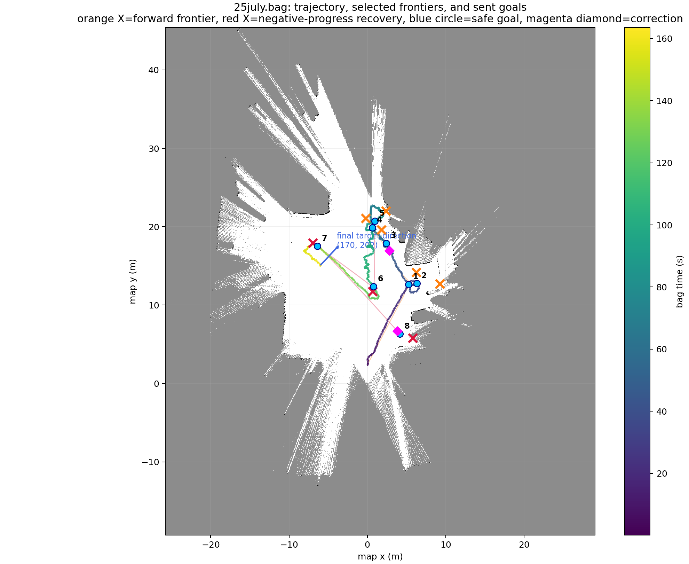
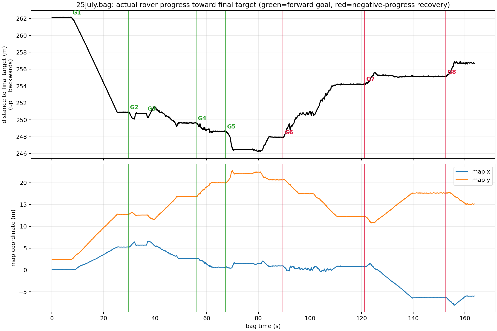
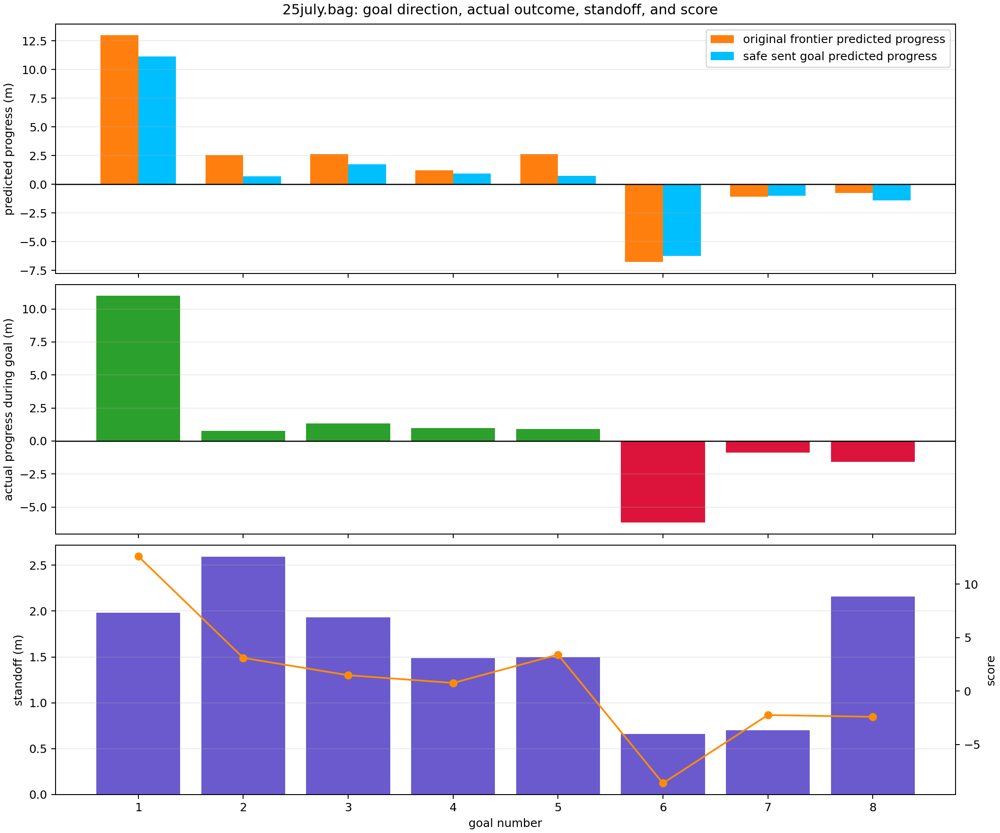
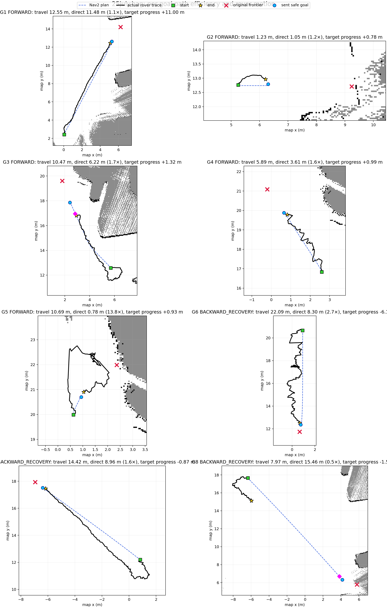
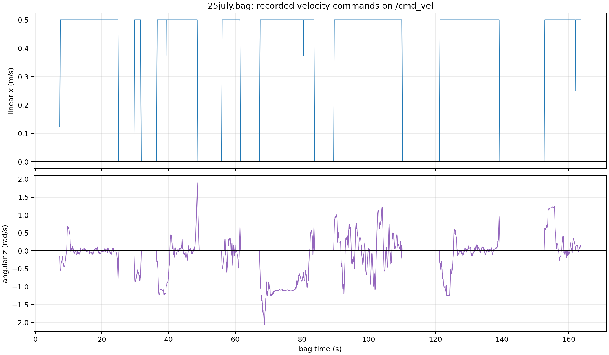
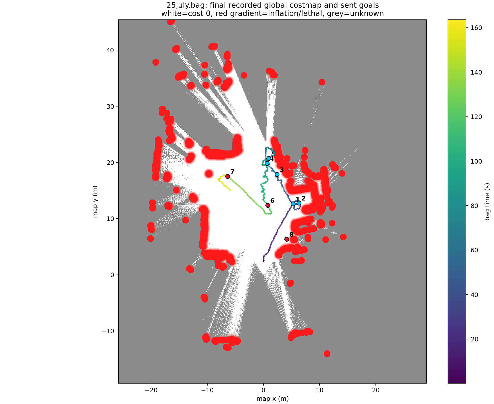
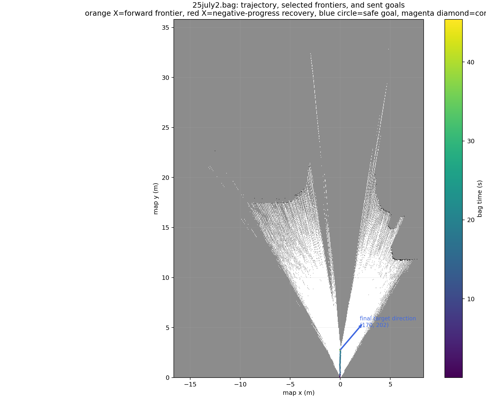

# 25 July target_explorer/Nav2 bag investigation

## Executive conclusion

There are **two separate problems** in these recordings.

1. **The large backwards missions are deliberately selected by the frontier
   policy.** They are not caused by the adaptive frontier standoff. The recorded
   parameter `allow_negative_progress_recovery=true` tells the selector to use
   the best negative-progress frontier whenever every forward-progress frontier
   has been filtered out. The node explicitly logged this before goals 6, 7,
   and 8.

2. **The rover also has a path-following/steering oscillation problem after a
   goal is accepted.** It often receives nearly constant `0.5 m/s` forward
   commands while angular commands are large and change sign. The worst example
   is goal 5: the sent goal was only `0.78 m` away, but the map-frame trace was
   `10.69 m` and independent `/genz/odometry` measured about `9.67 m`. Nav2
   logged `Failed to make progress`, cleared both costmaps, replanned, and only
   then reported success.

The adaptive initial standoff stayed between **0.66 m and 2.59 m** in the main
bag. It never produced a 10 m or 20 m standoff. The large regression came from
choosing whole frontiers behind the rover, followed by inefficient path
tracking.

No production code or configuration was changed during this investigation.
The bags were opened read-only.

## Most useful figures

### Entire mission in map space



Orange crosses are original forward-progress frontiers. Red crosses are
negative-progress recovery frontiers. Blue circles are the actual safe goals
sent to Nav2. Magenta diamonds are active-goal corrections.

The route changes direction sharply at goal 6, then continues to goals 7 and 8
away from the final-target direction.

### Distance to the final target over time



The upper plot is decisive: lower is closer to `(170, 202)`. Goals 1–5 reduce
the distance. Goals 6–8 increase it. The red goal lines exactly coincide with
the reversals.

### Predicted frontier progress, actual safe-goal progress, and outcome



The orange/blue difference also shows an important design consequence: scoring
uses the real frontier, while navigation goes to the shortened safe goal. The
safe goal usually provides much less immediate progress than its frontier
score implies.

### Per-goal rover traces



Goal 5 visibly loops around a goal less than one metre away. Goal 6 wiggles down
an eight-metre route that is pointed away from the final target.

### Velocity commands



While goals are active, the smoothed linear command is almost always
`0.5 m/s`. Angular demand reaches approximately `-2.06` to `+1.9 rad/s`.
There is no negative linear command in the bag.

### Final global costmap



This is the last recorded costmap, not a time-synchronized snapshot for every
goal. It is useful for spatial context but must not be read as the exact
costmap that existed at each dispatch.

## Bag inventory

| Bag | Start (local) | Duration | Messages | Candidate cycles | Frontier goals | Notes |
|---|---:|---:|---:|---:|---:|---|
| `25july.bag` | 18:18:55 | 163.68 s | 2,574,215 | 8 | 8 | Complete navigation episode |
| `25july1.bag` | 18:25:14 | 11.16 s | 173,237 | 2 | 0 | Existing node; no startup parameter event |
| `25july2.bag` | 18:27:37 | 45.46 s | 718,436 | 10 | 0 | New target_explorer starts at bag time 24.89 s |

`25july.bag` recorded 8 messages on
`/target_explorer/selected_frontier` and 10 on
`/target_explorer/selected_goal`. The extra two actual-goal messages correspond
to the two successfully dispatched active-goal corrections. This is consistent
with the one-shot correction state machine; it is not goal spam.

## Goal-by-goal evidence

Progress is the reduction in Euclidean distance to the configured final target
`(170, 202)`. Negative means the rover/frontier is farther from the final
target.

| Goal | Original frontier | Sent safe goal | Score | Path standoff | Frontier predicted progress | Safe-goal predicted progress | Actual progress during goal | Result |
|---:|---:|---:|---:|---:|---:|---:|---:|---|
| 1 | `(6.24, 14.21)` | `(5.27, 12.62)` | 12.606 | 1.98 m | +13.00 m | +11.16 m | +11.00 m | Forward |
| 2 | `(9.24, 12.71)` | `(6.30, 12.79)` | 3.107 | 2.59 m | +2.56 m | +0.71 m | +0.78 m | Forward |
| 3 | `(1.79, 19.61)` | `(2.41, 17.86)` | 1.483 | 1.93 m | +2.63 m | +1.76 m | +1.32 m | Forward; corrected to `(2.83, 16.95)` |
| 4 | `(-0.21, 21.09)` | `(0.65, 19.88)` | 0.759 | 1.49 m | +1.22 m | +0.93 m | +0.99 m | Forward |
| 5 | `(2.36, 21.99)` | `(0.94, 20.70)` | 3.410 | 1.50 m | +2.64 m | +0.73 m | +0.93 m | Forward; controller recovery |
| 6 | `(0.66, 11.74)` | `(0.76, 12.36)` | -8.626 | 0.66 m | **-6.77 m** | **-6.24 m** | **-6.18 m** | Negative recovery |
| 7 | `(-6.94, 17.94)` | `(-6.38, 17.52)` | -2.243 | 0.70 m | **-1.06 m** | **-0.98 m** | **-0.87 m** | Negative recovery |
| 8 | `(5.79, 5.79)` | `(4.16, 6.32)` | -2.408 | 2.16 m | **-0.74 m** | **-1.38 m** | **-1.57 m** | Negative recovery; bag ends after correction to `(3.83, 6.69)` |

Goal 8's actual progress and travelled distance are partial because the bag
ends before that action reaches a terminal state.

### Exact logs proving negative recovery was intentional

- Bag time `89.465 s`: `No forward-progress frontier is reachable; using
  recovery frontier (0.66, 11.74).`
- Bag time `121.142 s`: `No forward-progress frontier is reachable; using
  recovery frontier (-6.94, 17.94).`
- Bag time `152.619 s`: `No forward-progress frontier is reachable; using
  recovery frontier (5.79, 5.79).`

The selector then reports negative scores and dispatches all three.

### Why `minimum_target_progress_m` did not stop this

The main bag recorded:

```text
minimum_target_progress_m = 0.0
allow_negative_progress_recovery = true
```

The selection code first looks for candidates at or above the progress
threshold. If none exist and negative recovery is enabled, it selects the
highest-scoring candidate from the entire remaining list. Therefore the minimum
progress threshold is intentionally bypassed in recovery mode.

`25july2.bag` used `minimum_target_progress_m=0.4`, but still had
`allow_negative_progress_recovery=true`. Raising the minimum alone does not
prevent negative recovery; it only makes the selector enter recovery more
often when no candidate clears the higher threshold.

## Why forward goals disappear

The negative-recovery setting becomes dangerous because the safety and
reachability stages remove a very large fraction of candidates.

### Main bag rejection totals

- 444 frontier endpoints rejected by the older `0.10 m` physical-clearance
  check.
- 303 reachable frontiers rejected because no safe interior path point was
  found.
- 186 `GridBased: failed to create plan with tolerance 0.50` planner failures.
- Safe-point sample rejection totals:
  - 72,543 due to unknown occupancy cells inside the known-free circle.
  - 17,130 due to unknown global-costmap cells.
  - 1,380 due to nonzero/inflated costmap cost.
  - 302 candidates exhausted the configured maximum backward search.

Recorded safety parameters in `25july.bag`:

```yaml
frontier_goal_safety:
  backward_search_step_m: 0.01
  maximum_backward_search_distance_m: 3.0
  unknown_clearance_radius_m: 0.15
  costmap_safety_radius_m: 0.65
  maximum_safe_cost: 0
  treat_costmap_unknown_as_unsafe: true
```

This is safe but conservative: every overlapping SLAM cell in the `0.15 m`
circle must be confidently white, and every costmap cell in the `0.65 m`
circle must have cost exactly zero.

### Short bag: `25july1.bag`

- 2 candidate cycles.
- 18 endpoint-clearance rejections.
- 102 frontiers with no valid safe interior point.
- 2 cycles ended with `Nav2 found no reachable safe frontier candidate`.
- No selected-frontier or selected-goal message.

The node was already running before this bag started, so its startup parameter
events are not in the recording.

### Tightened experiment: `25july2.bag`

This bag recorded:

```yaml
goal_progress_weight: 1.2
minimum_target_progress_m: 0.4
allow_negative_progress_recovery: true
frontier_goal_safety:
  maximum_backward_search_distance_m: 0.5
  unknown_clearance_radius_m: 0.15
  costmap_safety_radius_m: 0.95
  maximum_safe_cost: 0
```

Outcome:

- 10 candidate marker cycles and 9 completed no-goal cycles.
- 35 endpoint-clearance rejections.
- 236 candidate frontiers rejected by safe-interior checking.
- 12,036 sampled poses rejected by the SLAM unknown-cell rule.
- Zero selected frontiers and zero goals from target_explorer.

At a `0.01 m` step and `0.5 m` limit, each failed candidate receives 51
samples. `236 × 51 = 12,036`: **every sampled pose for every evaluated
candidate failed the known-free SLAM-circle check**. The larger `0.95 m`
costmap radius is not even the limiting factor in these logs; the SLAM test
fails first.

This explains “sometimes it doesn't take a proper goal”: after tightening the
maximum search to `0.5 m`, there is often no valid goal at all.



The movement in `25july2.bag` is not attributable to target_explorer: it
published no selected goal and the bag contains zero `/cmd_vel` and
`/cmd_vel_nav` messages.

## The path-following “spazzing”

The goal selector explains where the rover is told to go. It does not explain
the long loops after accepting a short valid goal.

| Goal | Direct distance to sent goal | Map-frame trace | `/genz/odometry` trace | Trace/direct | Angular sign changes | 95th percentile `|angular.z|` | Fraction near full `0.5 m/s` |
|---:|---:|---:|---:|---:|---:|---:|---:|
| 1 | 11.48 m | 12.55 m | 12.25 m | 1.1× | 10 | 0.54 rad/s | 98.9% |
| 2 | 1.05 m | 1.23 m | 1.15 m | 1.2× | 0 | 0.85 rad/s | 87.8% |
| 3 | 6.22 m | 10.47 m | 9.70 m | 1.7× | 9 | 1.22 rad/s | 98.0% |
| 4 | 3.61 m | 5.89 m | 5.55 m | 1.6× | 11 | 0.49 rad/s | 96.4% |
| 5 | **0.78 m** | **10.69 m** | **9.67 m** | **13.8×** | 3 | **1.50 rad/s** | **98.5%** |
| 6 | 8.30 m | 22.09 m | 19.87 m | 2.7× | 18 | 1.04 rad/s | 98.8% |
| 7 | 8.96 m | 14.42 m | 13.67 m | 1.6× | 11 | 1.23 rad/s | 98.9% |
| 8 | 15.46 m | 7.97 m | 7.25 m | partial | 6 | 1.21 rad/s | 96.8% |

The independent odometry trace confirms that the goal-5 loop is not merely a
SLAM map-frame jump.

### Goal 5 event chain

- `67.230 s`: sends safe goal `(0.94, 20.70)`, only `0.78 m` from the rover.
- `69.481 s` and `70.580 s`: active safety sees cost 24 in the safety area.
- `70.582 s`: active correction finds no alternate safe cached-path point and
  deliberately keeps the original goal.
- `80.512 s`: controller_server logs `Failed to make progress` and aborts
  `follow_path`.
- `80.532 s`: local costmap is cleared.
- The behavior tree retries the controller.
- `81.831 s`: global costmap is cleared.
- `83.586 s`: controller reports reaching the goal.
- `83.621 s`: BT navigator reports success.

This is a real controller/recovery loop. The eventual success does not mean the
path following was healthy.

### Command evidence

Across the main bag:

- 3,126 `/cmd_vel` samples.
- No negative linear commands while moving.
- 95th percentile absolute angular command: `1.14 rad/s`.
- Maximum absolute angular command: `2.06 rad/s`.
- 71 angular-command sign changes.
- Goal 6 alone has 18 sign changes in about 20.6 seconds.

So “backwards” means backwards **relative to the final target**, not reverse
gear. The rover drives forward to a goal selected behind the desired mission
direction.

The current repository's Nav2 file is consistent with the recorded command
shape:

```yaml
FollowPath:
  desired_linear_vel: 0.5
  min_lookahead_dist: 0.8
  max_lookahead_dist: 1.2
  use_rotate_to_heading: false
  max_angular_accel: 6.5
  allow_reversing: false
general_goal_checker:
  xy_goal_tolerance: 0.25
  yaw_goal_tolerance: 6.28
```

Nav2 was running before bag recording began, so these Nav2 values are supporting
repository evidence rather than values captured in `/parameter_events`.
The command topics independently prove the important runtime behavior: nearly
constant full forward speed with large angular commands.

Potential control-side contributors are:

1. `0.5 m/s` remains commanded through high-curvature tracking.
2. Goal 5's direct distance (`0.78 m`) is shorter than the configured minimum
   lookahead (`0.8 m`).
3. Rotate-to-heading is disabled and goal yaw is effectively ignored.
4. The rover steering/RC conversion must accurately realize a Nav2
   differential-drive-style `angular.z`; any steering-kinematics mismatch
   produces arcs and overshoot.
5. The progress checker waits 10 seconds before abort/recovery, allowing a long
   loop before intervention.

The bag's `omega_controller` diagnostics further show the worst mean angular
tracking error on goal 5 (`0.46 rad/s`). This supports a control/tracking
problem, though it does not by itself identify whether the dominant source is
the Nav2 controller model, steering/PWM calibration, or vehicle dynamics.

## Active-goal correction is not the large reversal

Three unsafe events were confirmed:

- Goal 3: maximum safety-area cost 17; correction from `(2.41, 17.86)` to
  `(2.83, 16.95)`.
- Goal 5: maximum safety-area cost 24; no safe correction exists, so the
  configured `keep_original` fallback is used.
- Goal 8: maximum safety-area cost 75; correction from `(4.16, 6.32)` to
  `(3.83, 6.69)`.

The dispatched corrections are about one metre or less. They do not explain
the 6–8 m mission reversals. The correction state machine also does not perform
new frontier scoring while a goal is executing.

## Root-cause ranking

### 1. Proven primary cause of backwards mission progress

`allow_negative_progress_recovery=true`.

When no forward valid frontier survives reachability and safety checks, the
selector intentionally chooses a negative-progress frontier with no bound on
how negative it may be. Goal 6 was predicted to lose `6.77 m` and did lose
`6.18 m`.

### 2. Proven cause of missing goals / entering recovery

Forward candidates are heavily starved by planner failure and strict safety
rules. The `0.5 m` backward-search experiment in `25july2.bag` rejects every
sample of all 236 checked frontiers.

### 3. Proven motion-quality problem after dispatch

The rover path can be many times longer than the direct goal displacement.
Goal 5 is the clearest case, including an explicit Nav2 progress-checker
failure and costmap recoveries.

### 4. Secondary scoring mismatch

Scoring uses the original frontier as requested, but the actual sent point may
offer far less immediate target progress:

- Goal 2: original frontier `+2.56 m`, safe goal only `+0.71 m`.
- Goal 5: original frontier `+2.64 m`, safe goal only `+0.73 m`.
- Goal 8: original frontier `-0.74 m`, safe goal `-1.38 m`.

This does not corrupt the frontier score, but it means the score alone is not
an adequate dispatch guard.

## Recommended changes, in priority order

These are recommendations only; this investigation did not apply them.

### Immediate safety/behavior change

1. Set:

   ```yaml
   allow_negative_progress_recovery: false
   ```

   This is the direct way to stop large backward mission goals. Raising
   `minimum_target_progress_m` without disabling negative recovery is not
   sufficient.

2. Add a dispatch guard on the **actual safe goal's** target progress while
   preserving frontier scoring at the original frontier. For example, reject
   a prepared goal if it loses more than `0.0–0.5 m` of final-target progress.

3. If recovery frontiers are still required, make recovery bounded and
   stateful:

   - permit at most a small configured regression, such as `0.5–1.0 m`;
   - require several consecutive no-forward cycles before recovery;
   - blacklist recently reached frontier regions;
   - prevent alternating between previously visited lobes of the map.

### Restore goal availability without restoring unsafe goals

4. Do not combine a `0.5 m` maximum search with map data that needs more than
   `0.5 m` to reach a fully known circle. The bag proves this combination
   yields zero goals. A `2–3 m` search window is more compatible with the
   recorded diffused frontier, provided negative dispatch is disabled.

5. Reconsider the `0.95 m` costmap safety circle from `25july2.bag`. With
   `maximum_safe_cost=0` and unknown-as-unsafe, it is exceptionally strict.
   The main bag's `0.65 m` is closer to the configured `0.6 m` global-costmap
   robot radius.

6. Record one summary rejection per candidate/cycle rather than hundreds of
   repeated warnings. The current logs are diagnostically useful but extremely
   noisy.

### Fix the path-following oscillation

7. Run a low-speed controlled test at `0.15–0.25 m/s` and verify that speed
   actually reduces during high curvature. The current data stays near
   `0.5 m/s` for 96–99% of each active-goal command window.

8. If the rover is modeled as differential drive, enable rotate-to-heading and
   cap angular velocity/acceleration. If it is Ackermann/skid-steer with
   constrained steering, use a controller and kinematic model appropriate for
   that platform instead of assuming arbitrary `angular.z` can be realized.

9. Reduce the minimum lookahead or avoid dispatching sub-lookahead goals. Goal
   5 is `0.78 m` away while the configured minimum lookahead is `0.8 m`.

10. Explicitly configure the velocity smoother. Its configuration blocks are
    commented in the current YAML even though the launch starts the smoother.

11. Validate the complete `/cmd_vel_nav → /cmd_vel → steering/PWM → measured
    omega` chain with a step and sine sweep. Goal 5's angular tracking error is
    much worse than goal 1's.

## Mission-level result

During `25july.bag` the map-frame rover trace totals approximately `101.5 m`
(`/genz/odometry` totals about `91 m` over the whole bag), but net progress
toward `(170, 202)` is only **5.47 m**. The first five goals made roughly
`15.0 m` of progress; the three recovery goals then gave back about `8.6 m`
before the bag ended.

The system is therefore doing three expensive things in sequence:

1. rejecting most forward frontier/path combinations;
2. deliberately allowing a large backwards recovery frontier;
3. tracking some accepted paths inefficiently at high forward speed.

That combination—not the adaptive 0–3 m frontier standoff—is what produces the
observed behavior.

## Generated evidence files

- [`summary.json`](summary.json): machine-readable bag, parameter, goal, and
  metric summary.
- [`bag_summary.csv`](bag_summary.csv): one-row-per-bag metrics.
- [`goal_episodes.csv`](goal_episodes.csv): detailed per-goal calculations.
- [`target_explorer_parameters.csv`](target_explorer_parameters.csv): recorded
  target_explorer parameters.
- [`target_explorer_logs.csv`](target_explorer_logs.csv): complete
  target_explorer log timeline.
- [`navigation_events.csv`](navigation_events.csv): filtered Nav2
  planner/controller/BT/costmap events.
- [`analyze_bags.py`](analyze_bags.py): reproducible read-only analyzer.

Additional images:

- [`25july1 spatial`](plots/25july1_spatial.png)
- [`25july1 final costmap`](plots/25july1_costmap.png)
- [`25july2 progress`](plots/25july2_progress.png)
- [`25july2 final costmap`](plots/25july2_costmap.png)

## Method and limitations

- Data was deserialized directly from each SQLite rosbag in read-only mode.
- Rover map pose uses the recorded TF chain `map → base_footprint/base_link`.
- `/genz/odometry` was used as an independent travel-distance cross-check.
- Progress is Euclidean distance reduction to the configured final map target.
- Final occupancy/costmap images use the last recorded full grid.
- The bags do not contain Nav2 startup parameter events because Nav2 was
  already running. Runtime command/log behavior is authoritative; comparisons
  with the current Nav2 YAML are explicitly marked as supporting evidence.
- Goal 8 is incomplete at the end of `25july.bag`.
